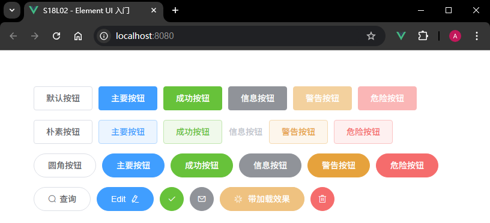
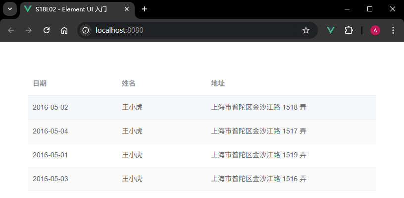
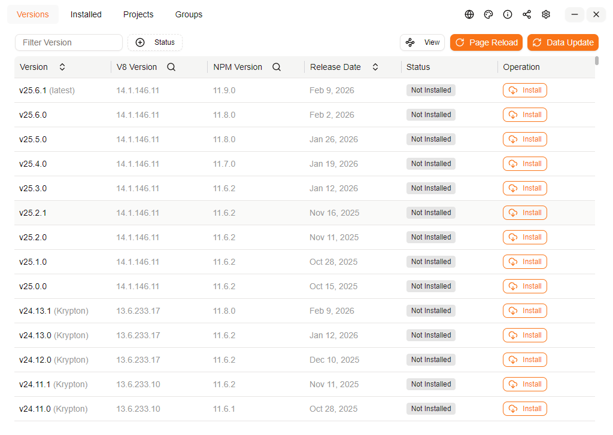
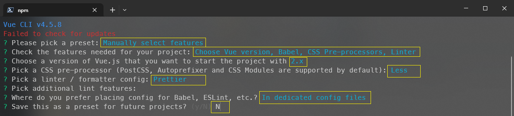

# L02：项目准备 part1(介绍 Element UI)

本节大致录制时间：`2021-07-06 15:54:00`。

---


## 1 概述

本套课程选定组件库：[Element UI](https://element.eleme.cn/#/zh-CN)。

通常前台系统需要专门的 `UI` 设计师单独设计页面组件；后台系统外观相对固定，通常基于成熟的组件库进行开发（后期会使用一个基于 `ElementUI` 的后台系统集中解决方案—— `VueElementAdmin`，因此采用 `Vue 2.x` 进行讲解）。


## 2 组件库的安装

安装命令：

```bash
npm i element-ui -S
```

示例一：使用 `Button` 组件（`03c278a`）



示例二：使用 `Table` 表格组件（`bb9d21c`）



学会查文档，培养自学能力，并通过实战项目强化理解。

其他组件库：`Vuetify`、`Vue Material`、`View UI` ……


## 3 实测备忘

:one: 弃用 `Volta`，换最新版 `NVM Desktop v4.2.0`（https://github.com/1111mp/nvm-desktop）。

因 `Volta` 全局安装 `@vue/cli@4.5.8` 后命令行无法创建 `Vue` 交互式界面，后台内存居高不下导致系统卡死；在多次尝试安装命令 `volta install @vue/cli` 及 `npm i -g @vue/cli@4.5.8` 后，卡死情况仍未解决，只能完全卸载 `Volta`，改用 `Vue` 入门与实战课第 `L43` 课增补内容中推荐的 `NVM Desktop` 工具：



基础配置：

- 安装位置：`D:\ProgramFiles\NVMDesktop`
- `NodeJS` 版本信息文件：`.nvmdrc`
- `NodeJS` 安装包存放位置：`D:\nvmd\versions`
- 镜像 `URL`：`https://npmmirror.com/mirrors/node`

本地重新安装 `NodeJS v14.21.3` 后，又重新安装 `@vue/cli@4.5.8`（与博客项目的前台系统所用 `node` 版本保持一致）。最新 `vue-cli` 脚手架创建参数如下：



实测命令：

```bash
# 改为本地镜像
npm config set registry https://registry.npmmirror.com/
# 重装 vue-cli 确保版本完全一致
npm i -g @vue/cli@4.5.8
vue create elem-first-dive
# -- snip --
cd elem-first-dive
npm run serve
```


:two: 手动变更 `htmlWebpackPlugin.options.title` 的默认值的方法：

```js
// vue.config.js
module.exports = {
  lintOnSave: false,
  chainWebpack: (config) => {
    config.plugin("html").tap((args) => {
      // 在这里设置你想要的项目标题
      args[0].title = "S18L02 - Element UI 入门";
      return args;
    });
  },
};
```

注意：当前项目的 `Webpack` 配置详情，可通过 `vue inspect > output.js` 存入某个文件（`output.js`），其中会详细注明每项配置在 `webpack-chain` 工具库中的正确写法：

```js
// vue inspect result:
plugins: [
  /* config.plugin('vue-loader') */
  new VueLoaderPlugin(),
  /* config.plugin('html') */
  new HtmlWebpackPlugin(
    {
      title: 'S18L02 - Element UI 入门',
      templateParameters: function () { /* omitted long function */ },
      template: 'F:\\mydesktop\\vueDemo\\elem-first-dive\\public\\index.html'
    }
  ),
}
```

