# L03：项目准备（二）：vue-element-admin 简介

本节录制时间：`2021-07-0415:30:00`。

---


本节主要介绍 `vue-element-admin` 的基本用法和核心功能特性。


## 1 概述

[`vue-element-admin`](http://panjiachen.github.io/vue-element-admin) 是一个 **后台前端解决方案**，它基于 [Vue](https://github.com/vuejs/vue) 和 [element-ui](https://github.com/ElemeFE/element) 实现。它使用了最新的前端技术栈，内置了 `i18n` 国际化解决方案，动态路由，权限验证，提炼了典型的业务模型，提供了丰富的功能组件，它可以帮助你快速搭建企业级中后台产品原型。

> [!tip]
>
> **何为【后台前端解决方案】**
>
> **后台前端解决方案** 是指专为开发后台管理系统而准备的一套 **完整的前端项目脚手架**，它把开发中常见的通用功能都提前封装好了。几乎每一个成熟的编程语言都有对应于某类业务领域的、成熟的一整套解决方案，例如基于 `PHP` 语言的——
>
> - `DolphinPHP`：即【海豚 `PHP`】，官网：http://www.dolphinphp.com/，一款基于 `ThinkPHP5.1.42LTS` 开发的一套开源 `PHP` 快速开发框架；
> - `DedeCMS`：即【织梦内容管理系统】，官网：https://www.dedecms.com/，是一款由上海卓卓网络科技有限公司研发的国产 `PHP` 网站内容管理系统；
> - `WordPress`：官网：https://wordpress.org/，一款基于 `PHP` 和 `MySQL` 开发的开源内容管理系统，是目前全球最流行的网站建设工具。


## 2 安装与使用

相关资源：

- 官网首页：http://panjiachen.github.io/vue-element-admin
- 完整版 `GitHub`：https://github.com/PanJiaChen/vue-element-admin [^1]
- 基础版 `GitHub`（适合二开）：https://github.com/PanJiaChen/vue-admin-template

实测本地运行（具体位置 `code/diy/admin/`，详见 `01de5e8`）：

```bash
git clone https://github.com/PanJiaChen/vue-element-admin.git
cd vue-element-admin
# 不推荐首选 cnpm 的变通方案：
npm i --registry=https://registry.npmmirror.com
npm run dev
```

> [!tip]
>
> **实测报错备忘录**
>
> 第三步安装本地依赖时多次在此处报错：
>
> 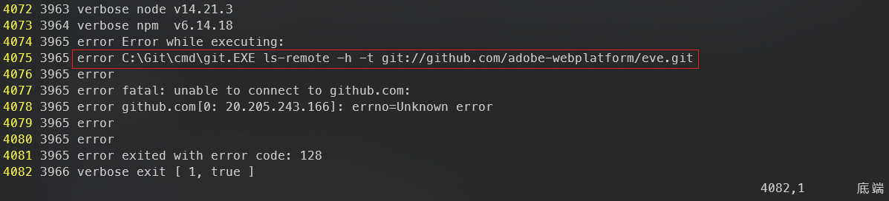
>
> 原因（`DeepSeek`）：`npm` 在尝试通过 `git://` 协议下载一个依赖 (`eve.git`) 时失败了。`GitHub` 已经不再支持这种不安全的明文协议，而你的本地 `Git` 环境还在尝试使用它，同时网络连接可能也存在一些波动。
>
> 解决方案：修改 `Git` 全局配置，将 `git://` 改为 `https://`：
>
> ```bash
> git config --global url."https://".insteadOf git://
> ```
>
> 也可手动修改 `Git` 全局配置文件：
>
> ```properties
> # ~/.gitconfig
> [url "https://"]
> 	insteadOf = git://
> ```
>
> 再次运行 `npm i` 命令即可。

按照视频要求同时下载完整版与基础版，分别通过开发模式启动：

完整版实测效果图：

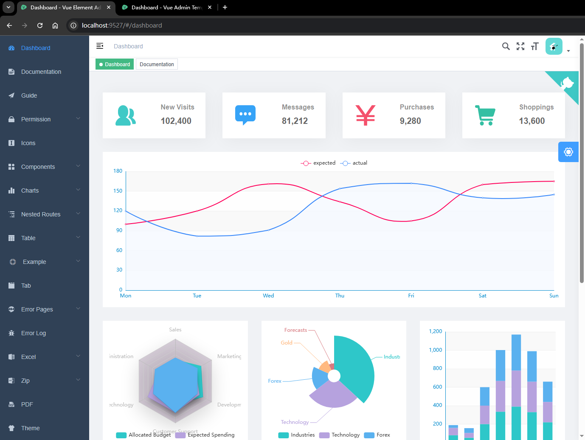

基础版实测效果图：

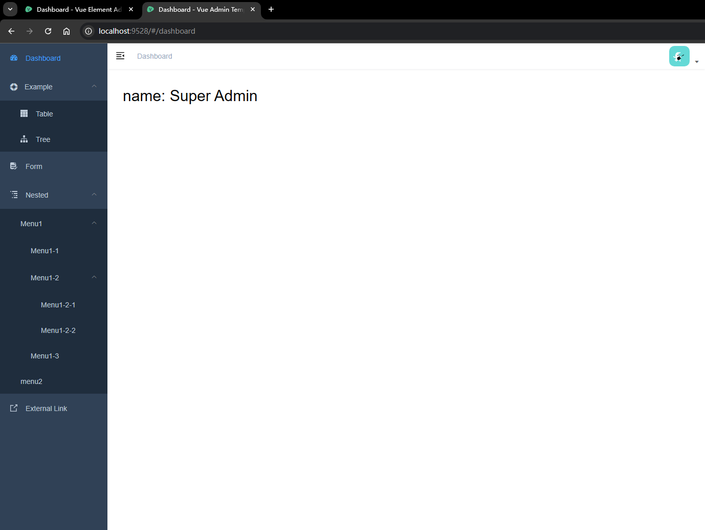


## 3 功能概览

### 3.1 首页看板

印象较深的是看板上方的统计数据区：

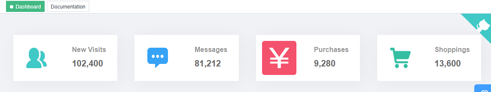

其中用到了一个带动画特效的数字组件 `CountTo`：

```html
<count-to :start-val="0" :end-val="102400" :duration="2600" class="card-panel-num" />
```


### 3.2 功能向导组件

效果图：

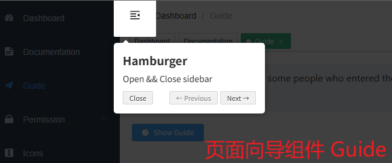


### 3.3 权限管理

主要分了三类：页面权限、指令权限及角色权限：

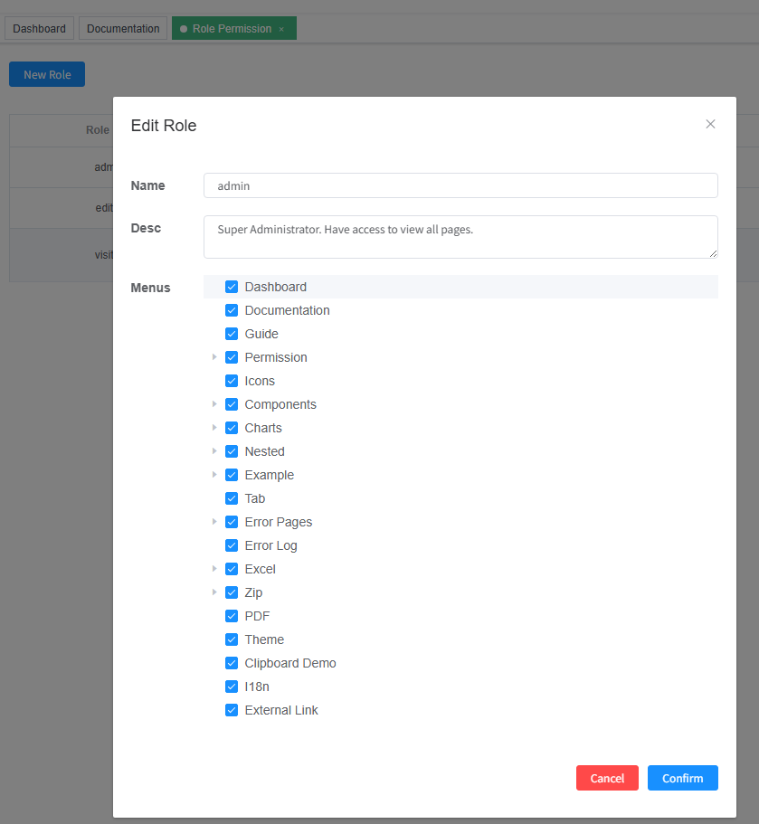


### 3.4 图标组件

也分三类：

- `vue-element-admin` 内置的图标；
- `ElementUI` 内置的图标；
- `iconfont` 定制图标：将自定义的 `svg` 格式的图标文件放到 `src/icons/svg` 下即可：

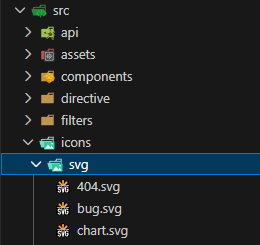


### 3.5 TinyMCE 富文本编辑器

修复了页面图标加载失败的 `Bug`（`//www.tiny.cloud/favicon-32x32.png`，详见 `d5524d4`）：

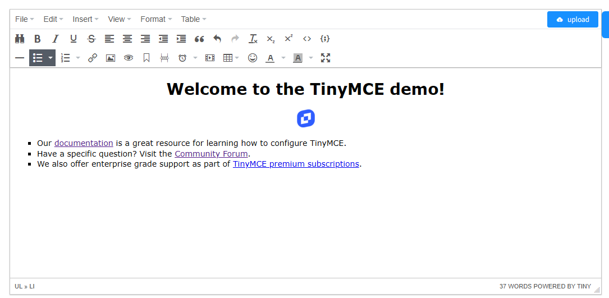

`TinyMCE` 是一款易用、功能强大且开源的 **所见即所得（WYSIWYG，What You See Is What You Get）富文本编辑器**。它通过简单的配置就能为 `Web` 应用提供类似 `Word` 的编辑体验，让用户无需编写代码即可格式化文本、插入图片和表格等。

这里有几个关于它的核心信息：

- 核心优势：
  - **插件丰富**：超 50 个插件支持协作、媒体优化等；
  - **框架友好**：提供 `React`、`Vue`、`Angular` 官方组件；
  - **高度可定制**：支持自定义插件和主题），且拥有超过 **150万开发者** 的用户基础；
- 如何收费：采用 **开源和付费并行** 的模式，核心编辑器在月启动量 ≤ 1000次时 **免费**（`GPL v2` 许可）。超出限制或使用协作修订、`AI` 助手等高级功能，则需购买付费计划。
- 快速上手：只需在页面引入脚本，用 `tinymce.init({ selector: 'textarea' })` 即可初始化。主流框架都有对应的集成封装包，安装后即可作为组件使用。
- 官方网站：https://www.tiny.cloud/（已借助 `GitHub` 帐号登录）。


### 3.6 Markdown 编辑器 :star:

基于 [tui.editor](https://github.com/nhn/tui.editor) 编辑器：

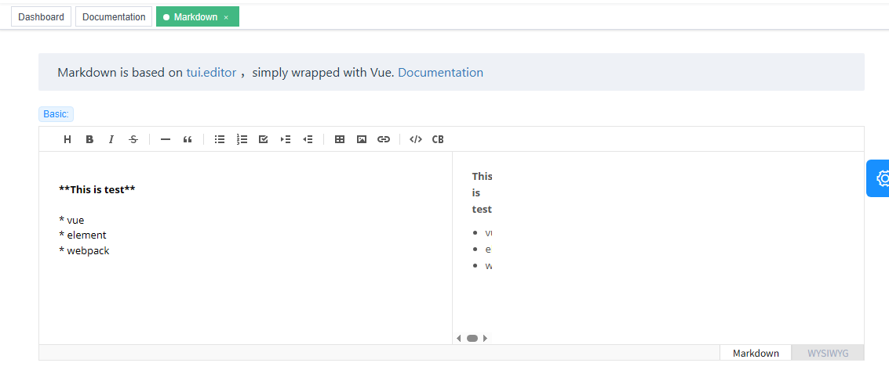

示例页的预览部分 `CSS` 样式有问题，该样式来自 `tui-editor` 依赖：

```js
// deps for editor
import 'codemirror/lib/codemirror.css' // codemirror
import 'tui-editor/dist/tui-editor.css' // editor ui
import 'tui-editor/dist/tui-editor-contents.css' // editor content
```

尝试修复样式失败（:star: 项目实战时应重点关注）：

```css
.tui-editor .te-preview-style-vertical .te-preview {
  width: fit-content;
}
```


### 3.7 图片上传组件

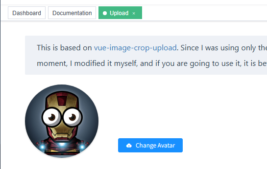

源自 [vue-image-crop-upload](https://github.com/dai-siki/vue-image-crop-upload)，可上传并裁剪图片。


### 3.8 图表

演示的三种图表均来自 `ECharts`：

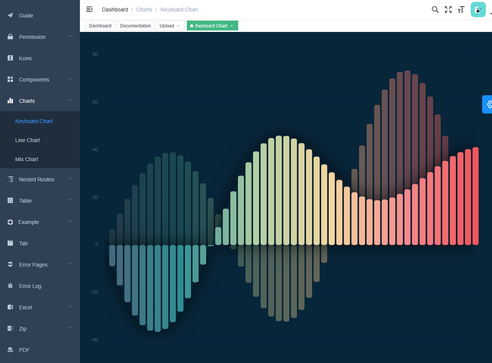


### 3.9 Table 表格

使用 `ElementUI` 的 `el-table`：

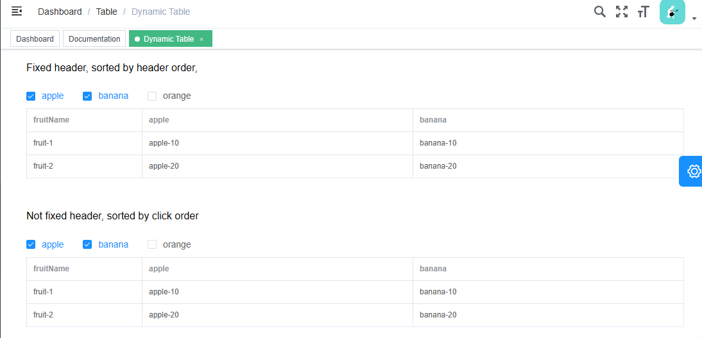


### 3.10 Tab 标签页

底层使用 `el-tabs` 和 `el-tab-pane` 组件实现：

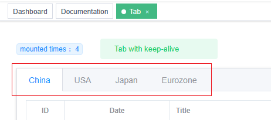


### 3.11 Excel 导入导出

导出：

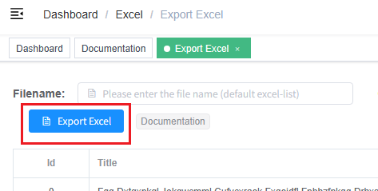

导入（上传）：

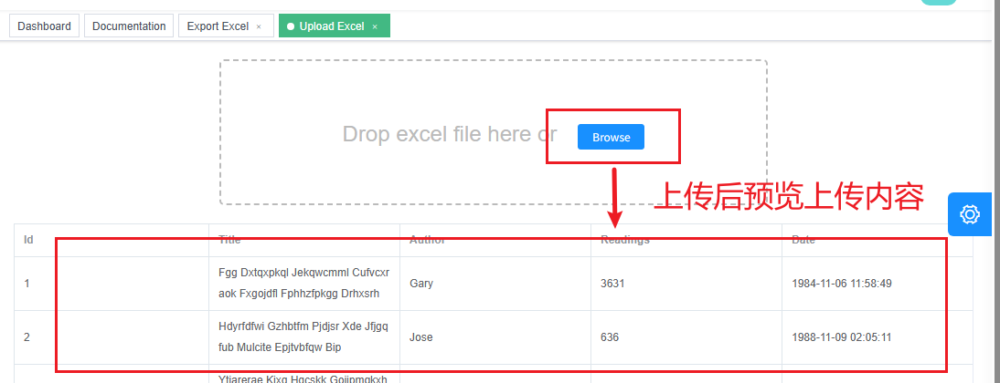


## 4 基础版功能概览

完整版固然功能强大，但也因此不太适合二次开发。因此本套课程主要基于基础版进行演示：

### 4.1 基础表单

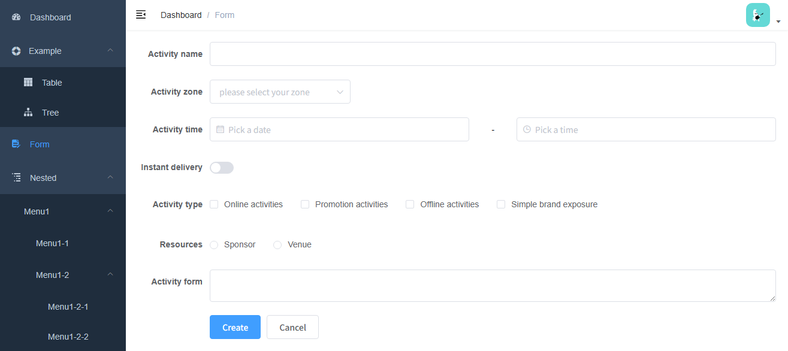


### 4.2 树形分类节点

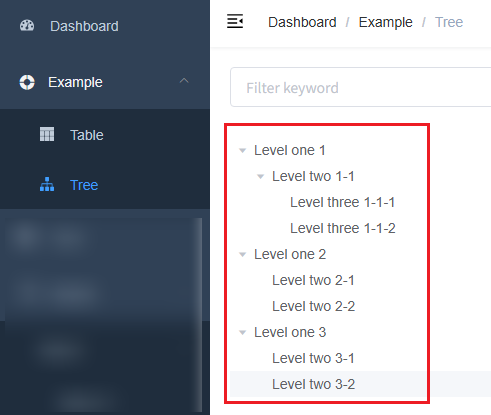


### 4.3 嵌套菜单

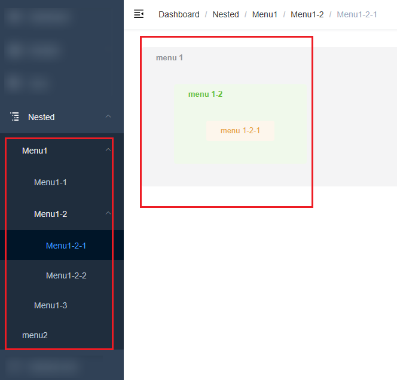


## 5 其他集成方案

不要拘泥于具体的集成方案，要以 `vue-element-admin` 为蓝本，快速上手更多流行的后台集成方案，如 `D2admin`（https://github.com/d2-projects/d2-admin）：

（`GitHub` 线上预览版：https://d2-projects.github.io/d2-admin）：

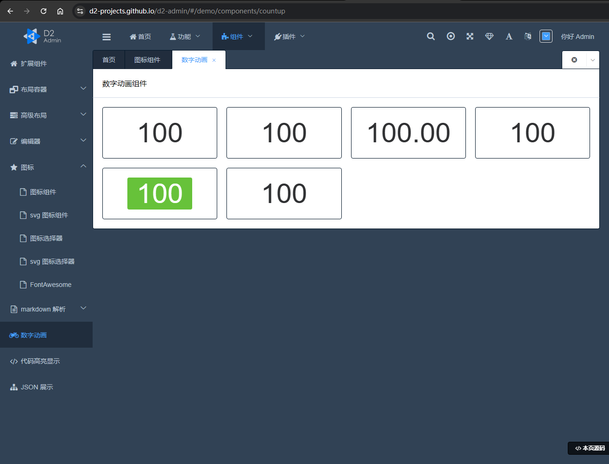


---

[^1]: 截至学习当天点赞数为 `90,283`，最近一次更新是 `2024-10-24` 更新赞助商信息。


