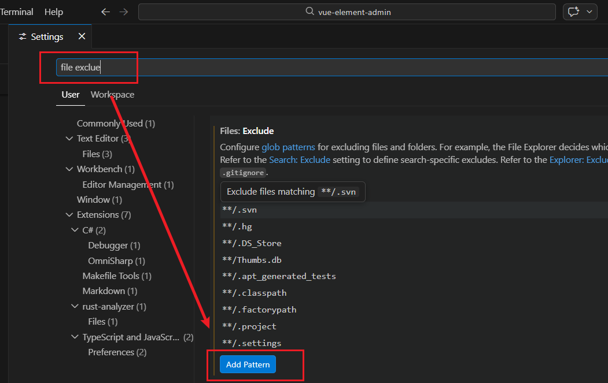
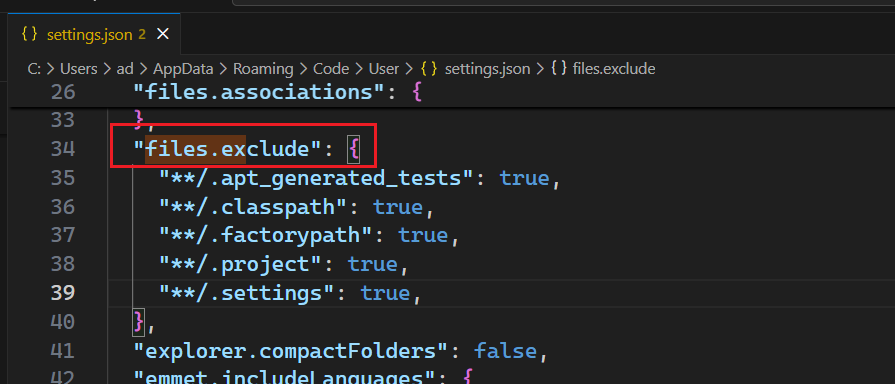
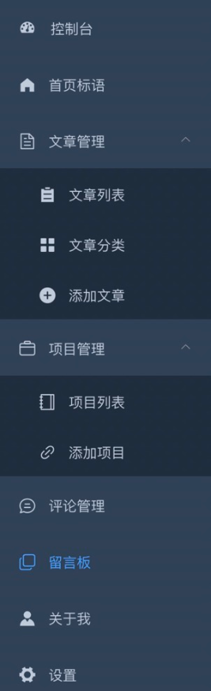
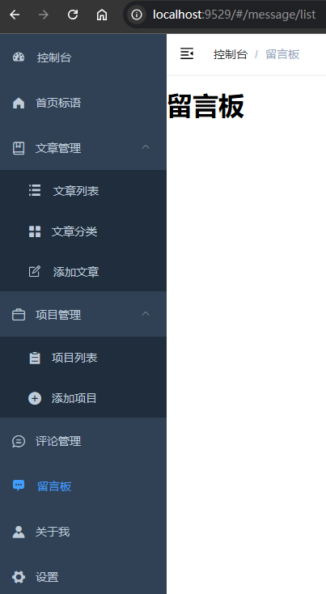
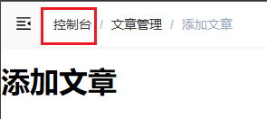
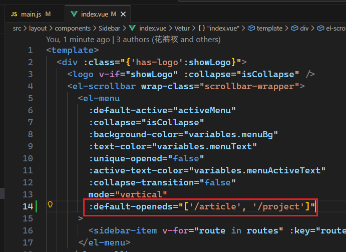

# L04：项目准备（三）：搭建基础项目

本节录制时间：`2021-07-15 14:13`。

---


本节基于 `vue-element-admin` 搭建基础项目，重点实现侧边栏的基础导航功能（具体页面内容待实现）。


## 1 项目结构

主要分为三个子模块：

- `mysite-client`：个人博客项目前台（《`Vue` 从入门到实战》配套项目）
- `background-system`：个人博客项目后台（本套课程配套项目）
- `mysite-server`：后端服务器（基于 `Egg.js`，已配好，无需实现）


## 2 不显示无关文件的设置

可在 `VSCode` 隐藏指定的文件，以免干扰开发：

做法：<kbd>Ctrl</kbd> + <kbd>Shift</kbd> + <kbd>P</kbd> 打开快捷菜单，输入 `settings` 打开设置界面，搜索 `file exclude` 关键字定位到 `Files: Exclude` 功能区：



点击 `Add Pattern` 按钮补充需要隐藏的具体文件，或者在 `VSCode` 的 `JSON` 配置文件中批量设置：



批量设置隐藏的文件：

```js
{
    "files.exclude": {
        "**/.git": true,
        "**/.svn": true,
        "**/.hg": true,
        "**/CVS": true,
        "**/.DS_Store": true,
        // "**/node_modules": true,
        "**/shims-tsx.d.ts": true,
        "**/shims-vue.d.ts": true,
        "**/.browserslistrc": true,
        "**/.eslintrc.js": true,
        "**/.gitignore": true,
        "**/babel.config.js": true,
        "**/package-lock.json": true,
        "**/README.md": true,
        "**/tsconfig.json": true,
        "**/.env": true,
        "**/.env.development": true,
        "**/.env.preview": true,
        "**/.env.production": true,
        "**/.travis.yml": true,
        "**/.env.staging": true,
        "**/.eslintignore": true,
        "**/.editorconfig": true,
        "**/.github": true,
        "**/tests": true,
        "**/jsconfig.json": true,
        "**/jest.config.js": true,
        "**/.postcssrc.js": true,
        "**/d2-admin.babel": true,
        "**/dependencies-cdn.js": true,
        "**/README.zh.md": true,
        "**/LICENSE": true,
        "**/postcss.config.js": true,
        "**/README-zh.md": true,
    }
}
```


## 3 路由与侧边栏的配置

`vue-element-admin` 通过 `router` 路由模块 + `views` 页面组件实现具体页面的切换。美中不足的是 **缺乏专门的目录管理页面**，只能在代码层面维护菜单。

路由和侧边栏是组织起一个后台应用的关键骨架。本项目侧边栏和路由是绑定在一起的，所以你只有在 `@/router/index.js` 下面配置对应的路由，侧边栏就能动态的生成了，大大减轻了手动重复编辑侧边栏的工作量。当然这样就需要在配置路由的时候遵循一些约定的规则。

更多用法详见官方文档：[路由和侧边栏](https://panjiachen.github.io/vue-element-admin-site/zh/guide/essentials/router-and-nav.html)。

待实现效果：



`DIY` 最终效果（`b5a9077`）：




## 4 实测备忘

:one: 面包屑组件的第一个节点硬编码为 `Dashboard`，需到 `@/components/Breadcrumb/index.vue` 下手动改为【控制台】（`b5a9077`）：




:two: 简版中缺少的 `SVG` 图标，如果是 `vue-element-admin` 内置的，则需要先从 **完整版** 中复制到 `@/icons/svg/` 目录下，然后再使用其样式类。若为 `ElementUI` 中的图标则无需手动复制。


:three: 如果要让【文章管理】和【项目管理】初始加载时自动展开，需要让 `Sidebar` 组件的 `el-menu` 子组件的 `default-openeds` 属性绑定一个路由数组（`b5a9077`）：

