# L05S1：项目准备（四）：服务器、接口与数据库

本节录制时间：`2021-07-16 16:15:00`。

---


## 1 后端接口与服务器准备

后端服务器源码地址：https://gitee.com/dev-edu/mysite-server

后端 `API` 接口文档：https://app.apifox.com/project/2429912 [^1]

其中，后端服务器使用 `Egg.js` 开发（`Egg.js` 是 `NodeJS` 的一个上层框架，由阿里出品，详细用法详见渡一选修课）。

关于课件：

- `mysiteDB.zip` 是课堂中所使用的数据备份，里面包含了所有的演示数据，可以将此数据恢复到本地 `MongoDB` 数据库中；
- `Mongodb.pdf` 是一个关于 `MongoDB` 的简易教程，里面包含了如何恢复数据。


> [!tip]
>
> **:star: :star: 后端接口运行的基本原理 :star: :star:**
>
> 为确保本课演示的后台项目 `background-system` 的正常运行，其调用的远程 `API` 接口由另一个后端项目 `mysite-server` 提供；该项目基于 `Egg.js` 开发，其后端服务器选用 `MongoDB`，如下图所示：
>
> ```mermaid
> graph TD
>     A[后台项目<br>background-system] --> B[后端API<br>mysite-server]
>     B --> C[(数据库<br>MongoDB)]
>     
>     B -.->|提供接口| A
>     C -.->|数据存储| B
> 
>     subgraph "前端/客户端"
>         A
>     end
>     
>     subgraph "后端服务层 (Egg.js)"
>         B
>     end
>     
>     subgraph "数据层"
>         C
>     end
> ```
>
> 因此，本节课的主要任务有两个：
>
> - 搭建并启动本地 `MongoDB` 数据库服务；
> - 搭建并启动本地后端接口服务 `mysite-server`（端口 `7001`，详见 `1.3` 小节）；


### 1.1 启动 MongoDB 本地服务

实测时，本地已安装 `MongoDB v5.0`，手动开启服务即可：

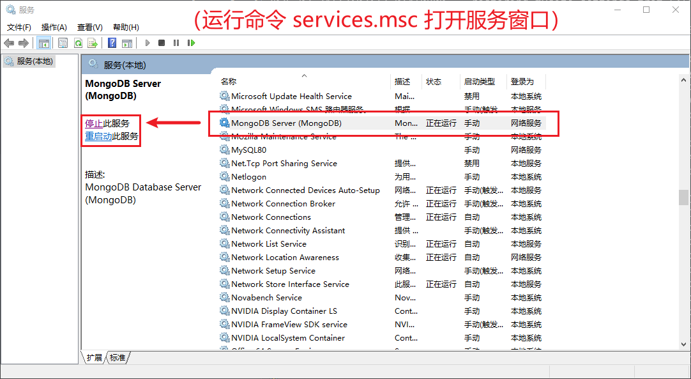


### 1.2 补充 MongoDB 命令行工具

查看 `MongoDB` 安装目录下的 `bin` 目录，发现缺少其它管理工具：

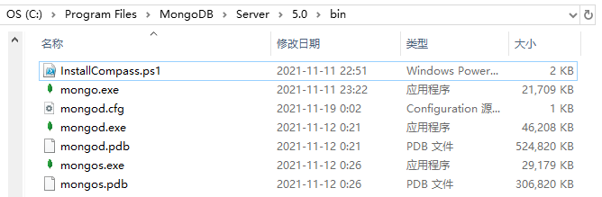

于是到 `MongoDB` [官网](https://www.mongodb.com/try/download/database-tools) 下载新版命令行工具：

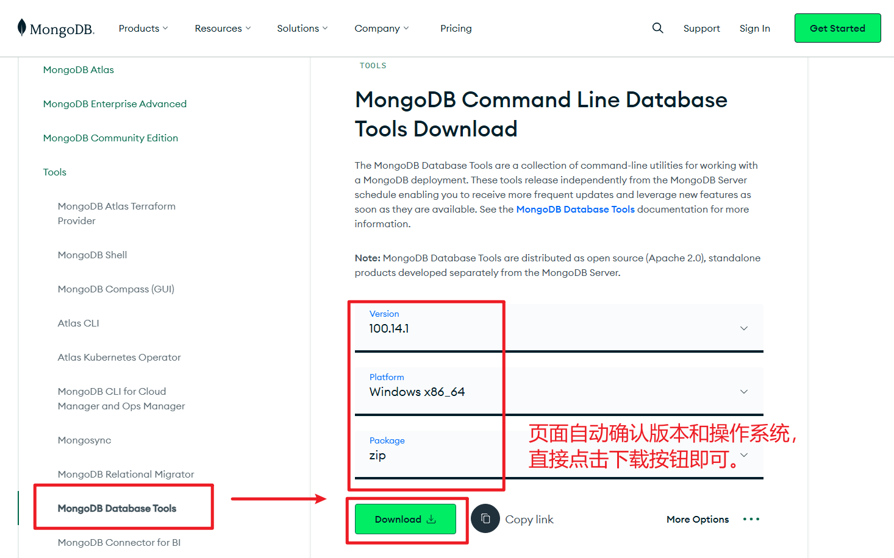

解压该 `zip` 压缩包文件 [^2]，将其中 `bin` 目录下的命令直接拷贝到 `MongoDB` 安装目录的 `bin` 目录下：

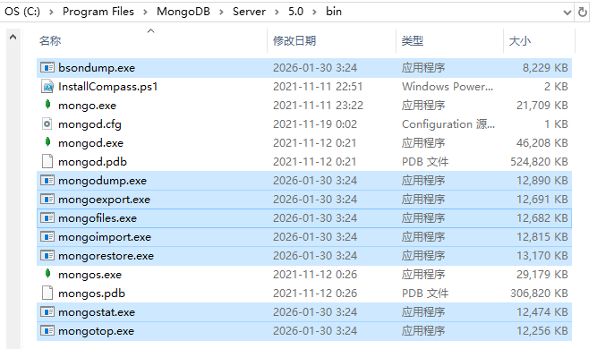

再次确认 `MongoDB` 服务已启动后，运行以下命令进行验证：

```bash
# 确认 MongoDB 服务是否正常
mongo --version
# 确认 MongoDB 数据备份工具是否正常
mongorestore --version
```

实测截图：

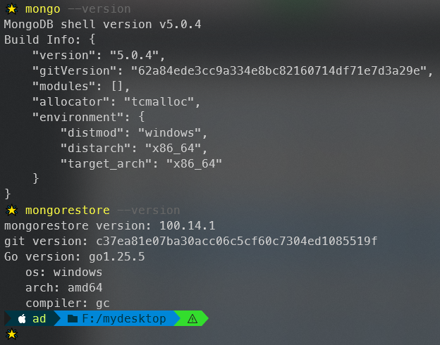

也可通过 `Navicat` 确认 `MongoDB` 服务是否成功开启：

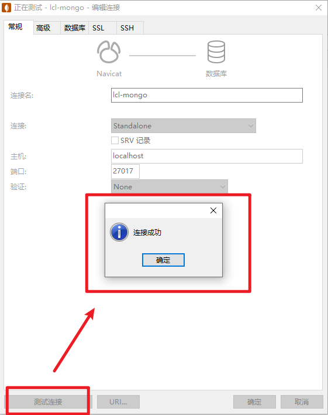


### 1.3 搭建本地后端项目

`Gitee` 源码：https://gitee.com/dev-edu/mysite-server。

将后端接口项目 `mysite-server` 代码拉取到本地并启动：

```bash
# 拉取源码
git clone https://gitee.com/dev-edu/mysite-server.git
cd mysite-server
# 安装依赖
npm i
# 运行后端站点
#  1. 以开发模式运行
npm run dev
#  2. 以 daemon 模式在系统后台运行
npm start
#  3. 若以 daemon 模式启动，须手动关闭后台接口服务
npm run stop
```

实测开发模式启动：

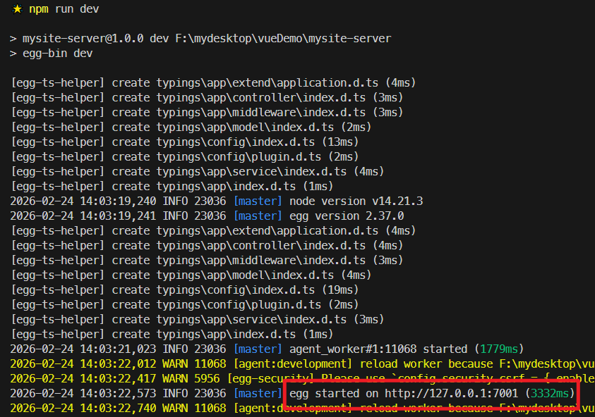

验证后端接口是否正常：在浏览器中打开获取验证码的接口地址 `http://localhost:7001/res/captcha` 即可：

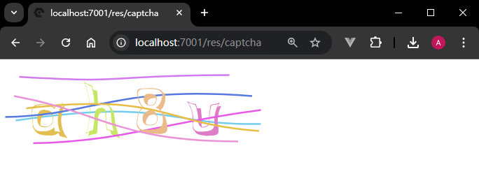


### 1.4 MongoDB 演示数据的批量加载

`mysite-server` 源码仓库中还附带了 `MongoDB` 演示数据的备份包 `mysiteDB.zip` [^3]，解压到桌面后备用：

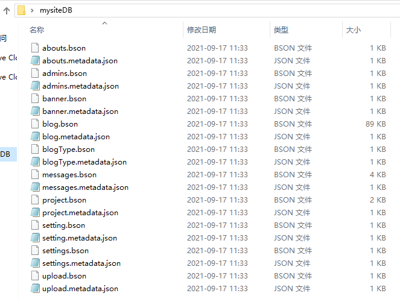

在 `PowerShell` 中运行以下命令恢复上述备份数据：

```bash
> mongorestore -h "localhost:27017" -d "mysite" --dir "F:\mydesktop\mysiteDB" --drop
```

> [!tip]
>
> **参数解释**
>
> - `-h`：`MongoDB` 所在服务器地址，即 `"localhost:27017"`；
> - `-d`：需要恢复的数据库实例，即数据库名称 `"mysite"`；
> - `--dir`：备份数据所在的具体文件夹的路径，即 `"F:\mydesktop\mysiteDB"`；
> - `--drop`：清空之前已有的数据后，再恢复指定的备份数据（即覆盖原来的 `mysite` 数据库相关信息）。

实测截图：

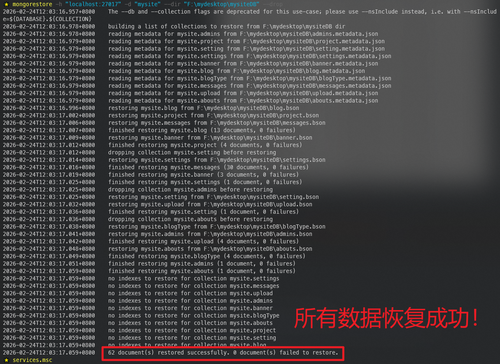

用 `Navicat` 二次验证：

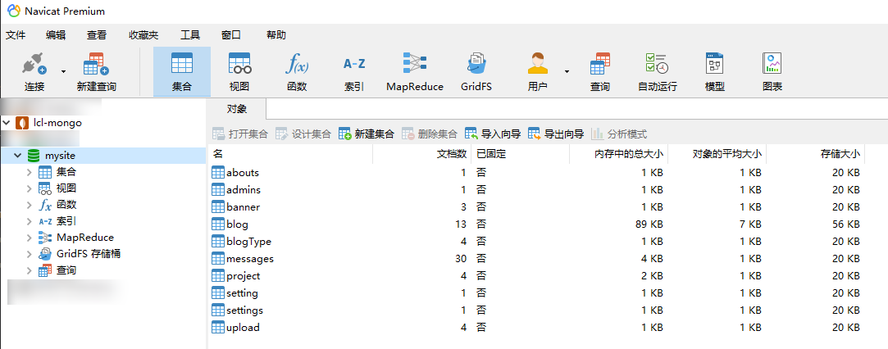


### 1.5 查看后端 API 接口文档

开通 `ApiFox` 访问权限后，找到个人博客项目：

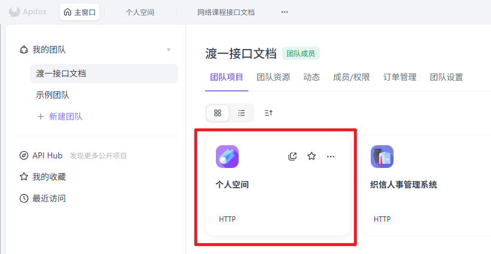

然后按照指定的 `API` 接口进行测试：

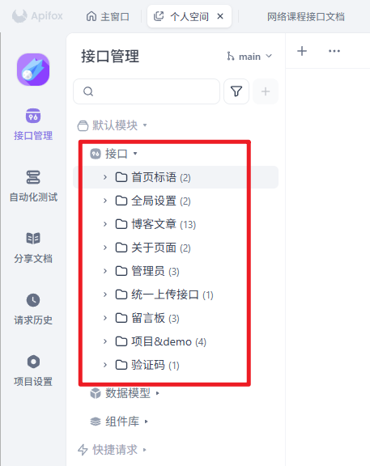

> [!important]
>
> 测试前，**务必确保** `MongoDB` 本地服务、以及后端接口站点 `mysite-server`（本地端口 `7001`）正常运行。
>
> 实测完毕，记得关闭相关服务。


## 2 实测备忘

本课学习要求：

学习课程 09. vue组件库从入门到实战 —— 05. 项目准备 part4(服务器和接口) 
学习方式：观看录播视频、完成课堂效果
关注重点： 
学会去看接口文档
把服务器从远程仓库拉取下来，能够正常运行
学习建议：一定要花时间把接口文档看懂，还有就是服务器要能够跑起来，不懂的话及时向老师求助，不然后面的开发没法下手


---

[^1]: 原 `YAPI` 接口已迁移至 `ApiFox`，新版接口需联系班主任开通访问权限。
[^2]: 完整压缩包已上传到百度网盘：`/SoftDev/渡一前端/41期/mongodb-database-tools-windows-x86_64-100.14.1.zip`
[^3]: 完整压缩包已备份至百度网盘：`/SoftDev/渡一前端/41期/mysiteDB.zip`


