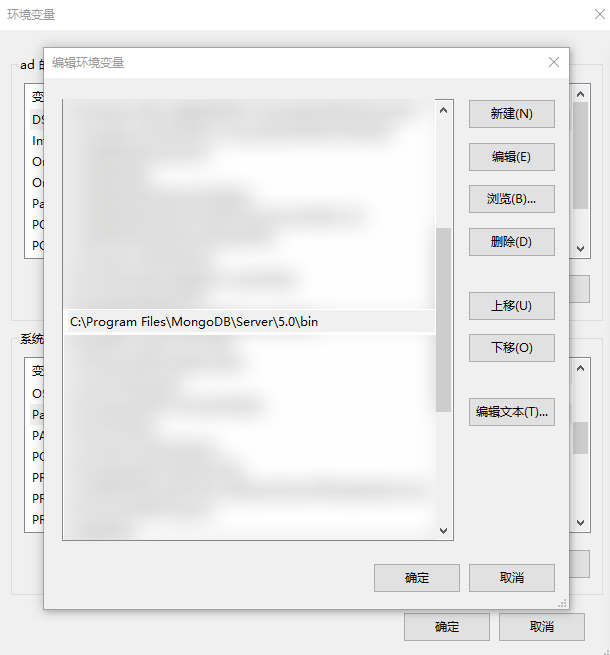
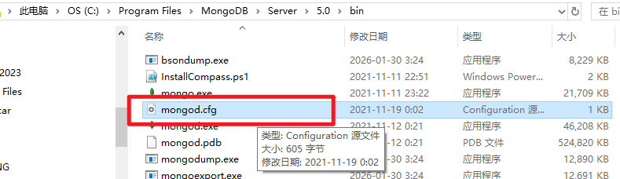

# L05S3：Mongodb 数据库相关操作（基于 Windows）

本节录制时间：`2022-09-11 15:45`。

---


## 1 要点梳理

本节主要演示了：

- `MongoDB 6.0`（当时的最新版）在 `Windows` 系统的安装过程；
- 数据库其它管理工具（主要是备份工具 `mongorestore`）的补充安装；
- `MongoDB` 数据库管理工具 `Studio 3T v2022.8.1` 的安装过程；
- 演示项目的完整数据库备份数据（`mysiteDB.zip`）的还原与加载；

由于实测时本机已安装 `MongoDB 5.0` 且能正常扩充其它管理工具，本节不再赘述上述操作细节（完整实测过程参考 `L05S1_server_and_api.md` 相关小节）。


### 关于 MongoDB 在 Windows 中的配置文件

`Windows` 安装 `MongoDB` 数据库后，会自带 `MongoDB` 配置文件。

具体位置：`C:/Program Files/MongoDB/Server/5.0/bin/mongod.cfg` 的文件。

`MongoDB` 的安装位置查看方法：

```bash
# 打开【系统属性】--【高级】面板
control "sysdm.cpl,,3"
# 在 PATH 环境变量中查找 MongoDB 的注册路径
```

查找 `MongoDB` 安装路径实测截图：



实测配置文件所在位置：



具体内容如下（原始版本）：

```properties
# mongod.conf

# for documentation of all options, see:
#   http://docs.mongodb.org/manual/reference/configuration-options/

# Where and how to store data.
storage:
  dbPath: C:\Program Files\MongoDB\Server\5.0\data
  journal:
    enabled: true
#  engine:
#  wiredTiger:

# where to write logging data.
systemLog:
  destination: file
  logAppend: true
  path:  C:\Program Files\MongoDB\Server\5.0\log\mongod.log

# network interfaces
net:
  port: 27017
  bindIp: 127.0.0.1


#processManagement:

#security:

#operationProfiling:

#replication:

#sharding:

## Enterprise-Only Options:

#auditLog:

#snmp:

```


### 本节学习要求

```markdown
学习课程 09. vue组件库从入门到实战 —— 05. 项目准备 part4(服务器和接口) 
学习方式：观看录播视频、完成课堂效果
关注重点： 
学会去看接口文档
把服务器从远程仓库拉取下来，能够正常运行
学习建议：一定要花时间把接口文档看懂，还有就是服务器要能够跑起来，不懂的话及时向老师求助，不然后面的开发没法下手
```

