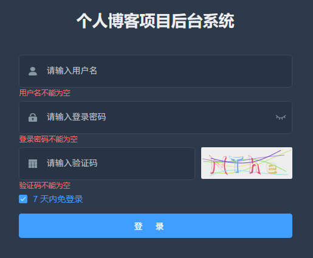

# L06：实现登录界面

本节录制时间：`2021-07-20 13:39`。

---


> [!tip]
>
> 本节主要实现功能：
>
> 1. 新增验证码字段；
> 2. 与后端验证码接口连通（配置代理服务器）；
> 3. 表单校验规则的定制；


## 1 要点梳理

### 1.1 引入 key 的作用

组件中的 `key` 的用法：`Vue` 会尽可能高效地渲染元素，通常会复用已有元素而不是从头开始渲染。如果不想复用它们，让元素完全独立，只需添加一个具有唯一值的 `key` 属性（`attribute`）即可（第 `L2` 行，具体示例及解释详见 [Vue 2 文档](https://v2.cn.vuejs.org/v2/guide/conditional.html#%E7%94%A8-key-%E7%AE%A1%E7%90%86%E5%8F%AF%E5%A4%8D%E7%94%A8%E7%9A%84%E5%85%83%E7%B4%A0)）：

```vue
<el-input
  :key="passwordType"
  ref="loginPwd"
  v-model="loginForm.loginPwd"
  :type="passwordType"
  placeholder="请输入登录密码"
  name="loginPwd"
  tabindex="2"
  auto-complete="on"
  @keyup.enter.native="handleLogin"
/>
```


### 1.2 自定义表单验证规则

用法：校验规则对象 `loginRules` 挂到 `el-form` 组件，然后与 `el-form-item` 组件的 `prop` 属性值相关联（`prop` 的值是 `loginRules` 中的属性名）：

```vue
<el-form :rules="loginRules">
  <el-form-item prop="loginId">
    <span class="svg-container">
      <svg-icon icon-class="user" />
    </span>
    <el-input
      ref="loginId"
      v-model="loginForm.loginId"
      placeholder="请输入用户名"
      name="loginId"
      type="text"
      tabindex="1"
      auto-complete="on"
    />
  </el-form-item>
</el-form>
```

自定义校验规则演示如下：

```js
export default {
  data() {
    const requiredField = ({message, required}, value, callback) => {
      if (required && !value) {
        callback(new Error(message))
      } else {
        callback()
      }
    };

    const validPattern = (rule, value, callback) => {
      const pattern = /^(?=.*[A-Za-z])(?=.*\d)[A-Za-z\d]+$/
      if (value && !pattern.test(value)) {
        callback(new Error('登录密码必须包含字母和数字'))
      } else {
        callback()
      }
    };
    
    return {
      loginForm: {
        loginId: '',
        loginPwd: ''
      },
      loginRules: {
        loginId: [{ required: true, trigger: 'blur', validator: requiredField, message: '请输入管理员帐号' }],
        loginPwd: [
          { required: true, trigger: 'blur', validator: requiredField, message: '请输入登录密码' },
          { min: 6, max: 20, trigger: 'blur', message: '登录密码长度必须在 6 - 20 之间' },
          { validator: validPattern, trigger: 'blur' }
        ],
        captcha: [{ required: true, trigger: 'blur', validator: requiredField, message: '请输入验证码' }],
      },
    }
  }
}
```

其中，自定义校验中的 `callback` 回调函数 **必须被调用**。更多高级用法可参考 [async-validator](https://github.com/yiminghe/async-validator)。


## 2 实测备忘

效果图：



:one: 忘记 `request` 模块使用了 `Mock` 数据，导致配置代理服务器成功后，页面始终无法加载验证码图片：

```js
service.interceptors.response.use(
  response => {
    const res = response.data
    // -- snip --
    return res;
  },
  error => {
    console.log('err' + error) // for debug
    Message({
      message: error.message,
      type: 'error',
      duration: 5 * 1000
    })
    return Promise.reject(error)
  }
)
```


:two: 验证码的渲染是通过 `v-html` 指令实现的，因此无法用于 `<el-image>` 组件的 `src` 属性。


:three: 视频中发现使用了 `base_url` 后直接将其注释（`L2`）：

```js
const service = axios.create({
  // baseURL: process.env.VUE_APP_BASE_API, // url = base url + request url
  // withCredentials: true, // send cookies when cross-domain requests
  timeout: 5000 // request timeout
})
```

其实还可以直接修改 `.env.development` 中的环境变量 `VUE_APP_BASE_API`：

```properties
# just a flag
ENV = 'development'

# base api
VUE_APP_BASE_API = '/'
```

