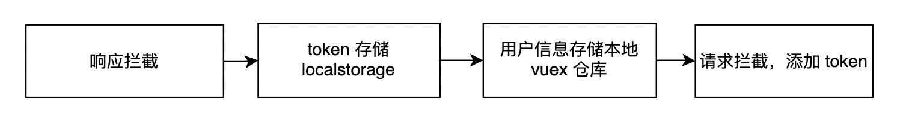
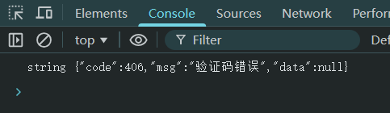
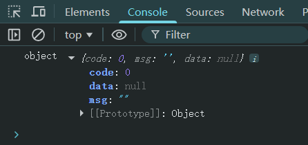
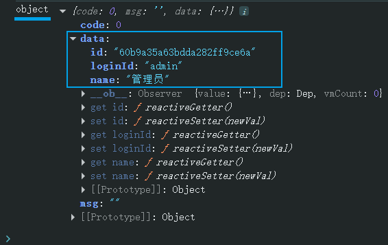

# L07：登录功能的实现

本节录制时间：`2021-07-20 20:21`。

---


本节实现不带权限校验的登录跳转逻辑。


## 1 要点梳理

### 点击登录按钮后的流程


### 服务器返回数据后的流程




## 2 实测备忘

:one: 系统管理员密码已改为 `123456`，不是视频中的 `654321`。


:two: 密码框的自动补全应该关闭，否则可能泄露密码信息（`@/views/login/index.vue`，第 `L13` 行）：

```html
<el-form-item prop="loginPwd">
  <span class="svg-container">
    <svg-icon icon-class="password" />
  </span>
  <el-input
    :key="passwordType"
    ref="loginPwd"
    v-model="loginForm.loginPwd"
    :type="passwordType"
    placeholder="请输入登录密码"
    name="loginPwd"
    tabindex="2"
    auto-complete="off"
    @keyup.enter.native="handleLogin"
  />
  <span class="show-pwd" @click="showPwd">
    <svg-icon
      :icon-class="passwordType === 'password' ? 'eye' : 'eye-open'"
    />
  </span>
</el-form-item>
```


:three: 不同登录状态的确定过程——

经实测，验证码错误时，整个 `response` 返回的是 `JSON` 字符串：



帐号或密码错误时，`response.data` 为 `null`：



全部正确时，`response.data` 为 `JS` 对象且字段非空：




:four: 登录过程交给 `Vuex` 主要是方便在后台应用中随时同步用户登录信息。
