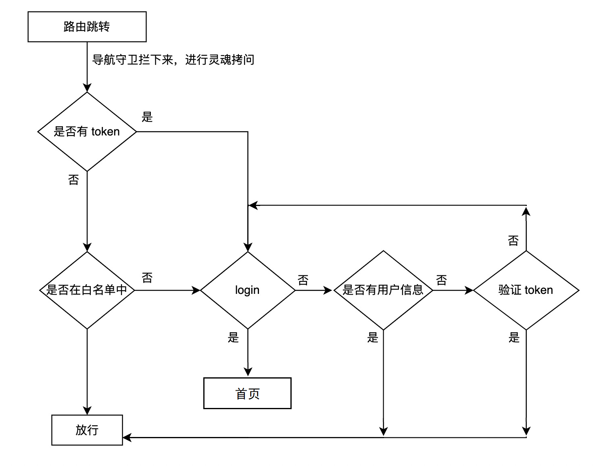
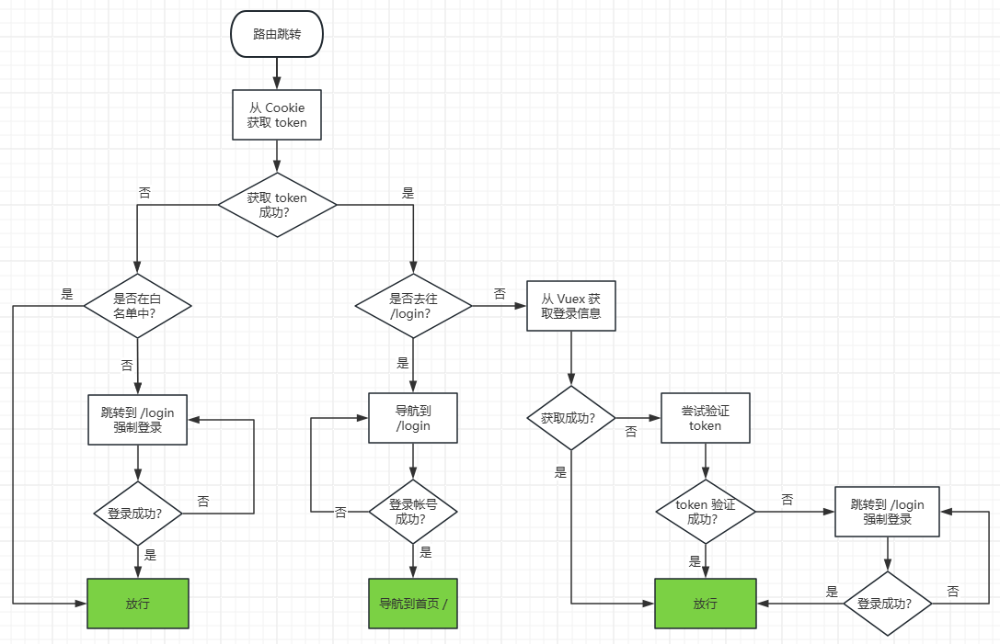
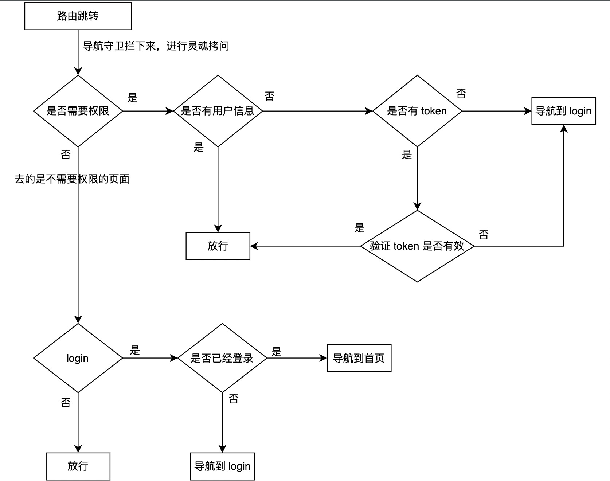
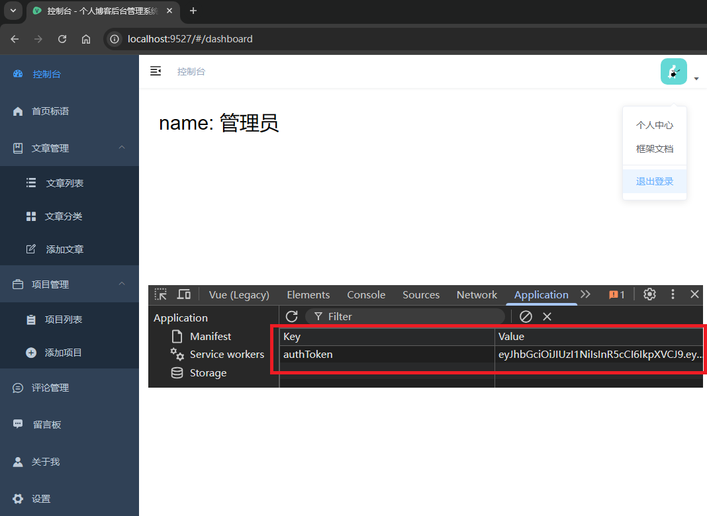

# L08：鉴权功能的实现

本节录制时间：`2021-07-21 9:52:00`。

---


本节实现基于 `localStorage` 本地存储的登录与鉴权逻辑。


## 1 要点梳理

### 1.1 vue-element-admin 中的鉴权流程

默认的鉴权逻辑利用了本地 `Cookie` 缓存登录令牌。

路由放行条件：

- 从 `Cookie` 获取 `token`——
  - 获取 `token` 失败：检查是否在白名单中——
    - 在白名单：放行；
    - 不在白名单：先强制登录，成功后再重定向到目标页面；
  - 获取 `token` 成功：检查是否去往登录页（`/login`）——
    - 是登录页：放行。待登录成功后跳转到首页；否则继续留在登录页；
    - 非登录页：尝试从 `Vuex` 获取用户登录信息（底层调用模拟 `API`）——
      - 登录信息获取成功：放行。
      - 登录信息获取失败：尝试验证 `token`——
        - 验证成功：放行
        - 验证失败：拦截至登录页（`/login`）强制登录——
          - 登录成功：重定向到指定页面（放行）；
          - 登录失败：继续停留在登录页，直至登录成功。

绘制流程图如下：

课件原图（有瑕疵）：



完善后的默认鉴权流程：




### 1.2 改造后的鉴权流程

通过在路由信息的 `meta` 中注明鉴权标识（`mata:{auto: true}`），重构鉴权逻辑如下（因 `token` 验证失败强制登录后的逻辑有缺失）：




## 2 实测备忘

:one: 实现鉴权逻辑时务必对照流程图，以免漏掉某些逻辑分支。

:two: 虽然路由守卫中可以使用 `return next();` 来提前结束判定逻辑，但可读性比纯 `if-else` 结构要差一些；

:three: 在 `meta` 中配置 `auth` 参数时写成了 `auto: true`，导致权限逻辑不生效；

:four: 提供的后端 `API` 接口没有获取用户头像的相关信息，只能在登录成功后直接硬编码（`L11`）：

```js
const actions = {
  // user login
  login({ commit }, loginParams) {
    return new Promise((resolve, reject) => {
      userLogin(loginParams).then(resp => {
        // -- snip --
        // resp: {code: 0, msg: '', data: {id:'xxxx', loginId: 'admin', name: '管理员'}}
        const { data } = resp;
        commit('SET_USER', data);
        commit('SET_NAME', data.name);
        commit('SET_AVATAR', 'https://wpimg.wallstcn.com/f778738c-e4f8-4870-b634-56703b4acafe.gif')
        resolve();
      }).catch(reject)
    })
  },
  // -- snip --
}
```


:five: 由于缓存到 `Vuex` 的登录用户信息是一个 `JS` 对象，而实测使用的 `DevTools` 版本又偏低，导致无法将其设为 `null`，从而不能直接放到 `if` 中判定是否已登录：

```js
// wrong:
if(userInfo) {
  // ...
}

// correction:
if(userInfo && userInfo.loginId) {
  // ...
}
// OR
const isLogin = !!(userInfo && userInfo.loginId);
if(isLogin) {
  // ...
}
```


实测效果：

