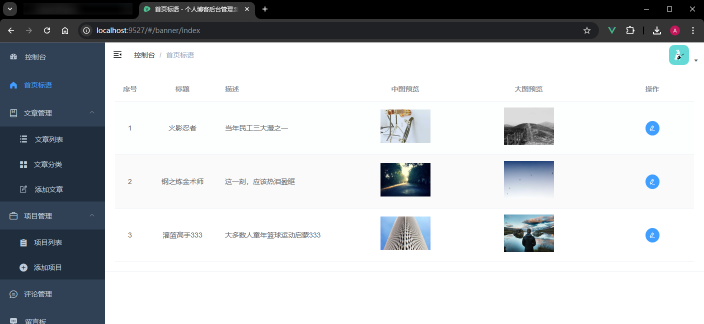
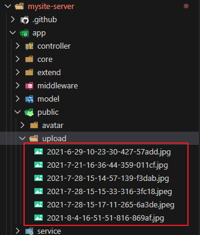

# L09：首页标语管理页的实现（一）

本节录制时间：`2021-07-21 13:33`。

---


本节主要实现首页标语管理页的页面渲染效果，暂不涉及交互逻辑。


## 1 要点梳理

### 1.1 右上角个人头像的加载

直接修改 `src/layout/components/Navbar.vue`：

```html
<!-- before -->

<!-- after -->

```

该问题上节 `DIY` 已解决：在 `store.user` 的登录方法 `login()` 中加一句即可：

```js
commit('SET_AVATAR', 'https://wpimg.wallstcn.com/f778738c-e4f8-4870-b634-56703b4acafe.gif')
```


### 1.2 表格的绘制

主要使用 `el-table` 组件（详见 [文档](https://element.eleme.cn/#/zh-CN/component/table)）。

其单元格内可放置任意 `HTML` 内容，通过作用域插槽实现：

```vue
<el-table :data="tableData" style="width: 100%">
  <el-table-column label="日期" width="180">
    <template slot-scope="scope">
      <i class="el-icon-time"></i>
      <span style="margin-left: 10px">{{ scope.row.date }}</span>
    </template>
  </el-table-column>
</el-table>
```


### 1.3 设置表格行号

```html
<el-table-column>
  <template slot-scope="scope">
    <span>{{ scope.$index + 1 }}</span>
  </template>
</el-table-column>
```


### 1.4 工具提示组件的用法

```html
<el-tooltip
  class="item"
  effect="dark"
  content="编辑"
  placement="top"
  :hide-after="hideAfter"
>
  <el-button type="primary" icon="el-icon-edit" circle size="mini"></el-button>
</el-tooltip>
```


## 2 实测备忘

效果图：




:one: **关于图片的处理**

由于 `Gitee` 中的后端源码不包含图片，实测时从 `mysite-server` 拿到的图片 `URL` 的格式均为 `/static/upload/2021-7-28-15-15-33-316-3fc18.jpeg` 的形式；于是通过 [Lorem Picsum](https://picsum.photos/) 网站生成随机图片后、另存到服务端静态资源目录下：

- 模拟中图：https://picsum.photos/300/200
- 模拟大图：https://picsum.photos/800/600

然后和数据库对照后批量命名：

```bash
# desktop/serverImgs:
mv big1.jpg 2021-7-28-15-15-33-316-3fc18.jpeg
mv mid1.jpg 2021-8-4-16-51-51-816-869af.jpg
mv big2.jpg 2021-7-28-15-14-57-139-f3dab.jpg
mv mid2.jpg 2021-6-29-10-23-30-427-57add.jpg
mv big3.jpg 2021-7-28-15-17-11-265-6a3de.jpeg
mv mid3.jpg 2021-7-21-16-36-44-359-011cf.jpg
```

最后批量复制到 `mysite-server` 图片目录下：

