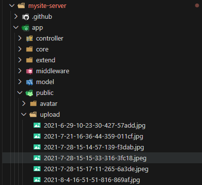
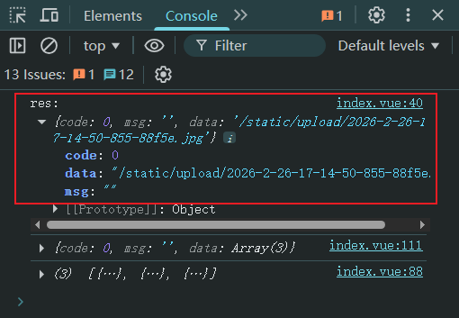
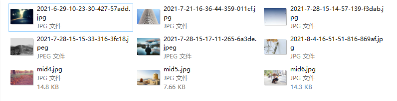
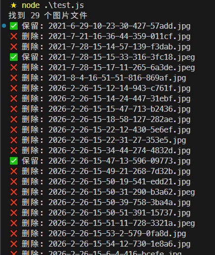

# L10：首页标语管理页的实现（二）：图片编辑与上传

本节录制时间：`2021-07-21 15:10`。

---


本节主要利用 `el-upload` 组件，实现首页标语记录中两张图片的修改与上传。


## 1 要点梳理

### 1.1 上传组件的用法

核心逻辑（`mysite-backend/src/components/Upload/index.vue`）：

```vue
<template>
  <div class="upload-container">
    <span class="title">{{ title }}</span>
    <el-upload
      class="avatar-uploader"
      action="/api/upload"
      :show-file-list="false"
      :on-success="handleAvatarSuccess"
      :before-upload="beforeAvatarUpload"
      :headers="headers"
    >
      
      <i v-else class="el-icon-plus avatar-uploader-icon" />
    </el-upload>
  </div>
</template>
```

这里的 `action="/api/upload"` 最终通过 `devServer` 转发到 `http://127.0.0.1:7001/api/upload`，这是一个具体在 `mysite-server` 中进行处理的 `POST` 请求，主要完成两件事：

- 图片转存到 `/public/upload/` 文件夹下；
- 将图片的 `URL`（相对路径）存入 `MongoDB`，并作为相应结果返回给后台系统；

实测图片上传位置：



实测上传请求的相应结果：



也正因为后端接口返回的是图片的相对路径，因此视频中新增的 `./src/urlConfig.js` 模块完全可以通过 `devServer` 的请求代理实现：

```js
// vue.config.js
module.exports = {
  // -- snip --
  devServer: {
    proxy: {
      // -- snip --
      '/static': {
        target: 'http://127.0.0.1:7001',
      }
    }
  },
  // -- snip --
}

// ./src/urlConfig.js
export const server_URL = 'http://127.0.0.1:7001';
```

这样也省去了在 `Banner` 页和 `Upload` 组件中反复给图片 `URL` 补全基础 `URL` 的冗余操作：

```js
// before
import { server_URL } from '@/urlConfig.js';
async getBanner() {
  try {
    const { data } = await fetchBanner()
    console.log(data) // {bigImg, description, id, midImg, title}
    this.tableData = data
    this.tableData.forEach(e => {
      e.midImg2 = server_URL + e.midImg
      e.bigImg2 = server_URL + e.bigImg
    })
  } catch (error) {
    this.$message.error(`获取数据失败: ${error.message}`)
  }
},

// after
async getBanner() {
  try {
    const { data } = await fetchBanner()
    console.log(data) // {bigImg, description, id, midImg, title}
    this.tableData = data
  } catch (error) {
    this.$message.error(`获取数据失败: ${error.message}`)
  }
},
```


## 2 实测备忘


> [!note]
>
> **注意**
>
> 实测代码中不包含实际上传的冗余图片，本次测试用到的图片均放在 `L10_banner_logics/serverImgs/` 目录下。


:one: 实测时将首页标语组件 `banner/index.vue` 进行了两次拆分：

- 主页面和对话框拆分；
- 对话框中的普通表单项和图片组件再次拆分；

这样维护起来更方便。


:two: 根据 `GitHub Copilot` 的提示，上传图片的相关限定（格式、大小等）可以在 `el-upload` 组件的 `before-upload` 钩子上自定义：

```vue
<el-upload
  class="avatar-uploader"
  action="/api/upload"
  :show-file-list="false"
  :on-success="handleAvatarSuccess"
  :before-upload="beforeAvatarUpload"
  :headers="headers"
/>
<script>
export default {
  name: 'Upload',
  methods: {
    handleAvatarSuccess(res) {
      console.log('res:', res) // {code: 0, msg: '', data: '/static/upload/2026-2-26-15-53-2-579-0fa8d.jpg'}
      this.$emit('input', res.data) // 将上传成功的图片URL传递给父组件
    },
    beforeAvatarUpload(file) {
      const isJPG = file.type === 'image/jpeg' || file.type === 'image/png'
      const isLt2M = file.size / 1024 / 1024 < 2

      if (!isJPG) {
        this.$message.error('只能上传 JPG/PNG 格式的图片!')
      }
      if (!isLt2M) {
        this.$message.error('上传图片大小不能超过 2MB!')
      }
      return isJPG && isLt2M
    }
  }
}
</script>
```

详见文档：[用户头像上传](https://element.eleme.cn/#/zh-CN/component/upload#yong-hu-tou-xiang-shang-chuan)。


:three: 快速修复 `ESLint` 检测的问题。

实测发现后台项目引入了很多自定义的 `ESLint` 规则。为了确保代码风格一致，新增了一个 `script` 脚本：

```bash
# "scripts": {"lint:fix": "eslint --ext .js,.vue src --fix"}
npm run lint:fix
```


:four: 图片上传逻辑中，图片文件按时间戳重命名，确保每次上传的图片都被保存；但由此也带来了大量冗余图片。

实际用到的示例图片：



实际保存的图片：


:five: 后端接口处理图片上传的具体位置：`mysite-server/app/controller/upload.js`：

```js
class UploadController extends Controller {
  async index() {
    const { ctx } = this;
    if (!ctx.request.files || ctx.request.files.length === 0) {
      ctx.app.error.throw(406, '服务端无法找到上传的文件数据');
    }
    if (ctx.request.files.length > 1) {
      ctx.app.error.throw(406, '服务端目前仅支持单个文件上传');
    }

    // 处理上传逻辑
    const file = ctx.request.files[0];
    const name = randomName();
    const ext = path.extname(file.filename);
    const basename = name + ext;
    const dest = path.join(__dirname, '../public/upload', basename);
    const url = ctx.app.config.static.prefix + 'upload/' + basename;
    await fs.promises.rename(file.filepath, dest);
    ctx.body = url;
  }
}
```


:six: 快速清除 `upload` 目录下的冗余图片

步骤：

- 提取所有在用图片的 `URL`：

  ```js
  console.log(data.flatMap(e => [e.bigImg, e.midImg]));
  ```

- 在 `upload` 文件夹下新建 `node` 脚本：

  ```js
  const fs = require('node:fs').promises;
  const path = require('node:path');
  
  // 需要保留的文件列表
  const filesToKeep = [
    '2021-7-28-15-15-33-316-3fc18.jpeg',
    '2026-2-26-17-0-11-571-d9fb4.jpeg',
    '2026-2-26-17-0-50-312-e7595.jpg',
    '2021-6-29-10-23-30-427-57add.jpg',
    '2026-2-26-17-14-50-855-88f5e.jpg',
    '2026-2-26-15-47-13-596-09773.jpg'
  ];
  
  // 将保留的文件列表转换为Set，方便快速查找
  const keepSet = new Set(filesToKeep);
  
  async function cleanImages() {
    try {
      // 获取当前文件夹下的所有文件
      const files = await fs.readdir(process.cwd());
      
      // 过滤出所有.jpg和.jpeg文件
      const imageFiles = files.filter(file => {
        const ext = path.extname(file).toLowerCase();
        return ext === '.jpg' || ext === '.jpeg';
      });
      
      console.log(`找到 ${imageFiles.length} 个图片文件`);
      
      let deletedCount = 0;
      let keptCount = 0;
      
      // 遍历所有图片文件
      for (const file of imageFiles) {
        // 检查文件是否在保留列表中
        if (keepSet.has(file)) {
          console.log(`✅ 保留: ${file}`);
          keptCount++;
        } else {
          try {
            // 删除文件
            await fs.unlink(path.join(process.cwd(), file));
            console.log(`❌ 删除: ${file}`);
            deletedCount++;
          } catch (err) {
            console.error(`删除失败 ${file}:`, err.message);
          }
        }
      }
      
      console.log('\n========== 操作完成 ==========');
      console.log(`保留文件数: ${keptCount}`);
      console.log(`删除文件数: ${deletedCount}`);
      console.log('==============================');
      
    } catch (err) {
      console.error('执行过程中出现错误:', err);
    }
  }
  
  // 执行清理函数
  cleanImages();
  ```

  - 执行 `node` 脚本，删除冗余图片。

  效果图：

  

