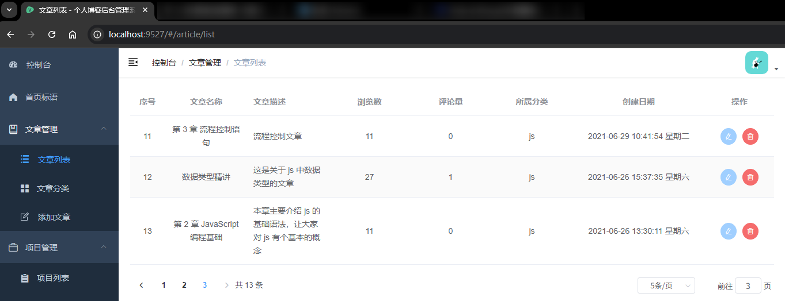

# L11：实现文章列表管理页（一）——列表渲染、删除、分页

本节录制时间：`2021-7-21 19:30`。

---


> [!tip]
>
> **内容提要**
>
> 文章管理模块分四节课进行介绍；本节为第一部分，主要实现前台【博客文章列表页】的后台管理页面。
>
> 具体实现功能如下：
>
> - 文章列表的渲染；
> - 标题悬停特效：鼠标悬停到【标题】字段时浮现该文章的封面头图，点击该图片还能直接打开前台的文章详情页；
> - 操作列的删除文章功能：要求带确认对话框（危险操作）
> - 用分页组件实现列表动态分页及渲染。
>
> 注意：由于代码量较大，文章编辑功能本节暂未实现，仅沿用 `Banner` 页的编辑图标占位。具体实现放到 `L13` 课


## 1 要点梳理

### 1.1 作用域插槽的最新写法

`slot-scope="scope"` 是 `Vue 2` 的废弃写法，应改为：

```vue
<el-table-column prop="id" label="序号" width="60" align="center">\
  <!-- <template slot-scope="item"> -->
  <template v-slot="item">
    <span>{{ item.$index + 1 }}</span>
  </template>
</el-table-column>
```


### 1.2 关于浮动弹框的 reference

标题列要求悬停特效，用到了 `el-popover` 组件，经尝试，最新的 `<template #reference>` 的写法不生效，必须写成 `slot="reference"`（`L10`）：

```vue
<el-table-column prop="title" label="文章名称" align="center">
  <template v-slot="{ row }">
    <el-popover
      placement="top-start"
      title="博客预览图"
      width="200"
      trigger="hover"
    >
      <el-link
        slot="reference"
        :underline="false"
        :href="targetUrl(row)"
        target="_blank"
      >
        {{ row.title }}
      </el-link>
      <el-image
        :src="row.thumb"
        :preview-src-list="[row.thumb]"
        style="width: 100px"
        fit="cover"
      />
    </el-popover>
  </template>
</el-table-column>
```


### 1.3 重构时间戳的格式化逻辑

视频中的时间戳写法太冗长，经实测，只需要利用框架自带的 `parseTime()` 函数即可：

```vue
<el-table-column prop="createDate" label="创建日期" width="230" align="center">
  <template v-slot="{ row }">
    <span>{{ row.createDate | formatDate }}</span>
  </template>
</el-table-column>

<script>
import { parseTime } from "@/utils";
const formatDate = ts => parseTime(ts, "{y}-{m}-{d} {h}:{i}:{s} 星期{a}");
export default {
  name: "ArticleList",
  filters: {
    formatDate,
  },
}
</script>
```


### 1.4 对删除文章功能的改造

在删除文章时判定是否需要再上翻一页（视频中放到获取分页数据的地方不太妥当）：

```js
deleteArticle({ id }) {
  this.$confirm("此操作将永久删除该文件, 是否继续?", "提示", { type: "warning" })
    .then(() => {
      // console.log("delete id:", id);
      this.loading = true;
      deleteArticle(id)
        .then(async () => {
          await this.getBlogList();
          this.loading = false;
          this.$message.success("删除成功!");

          // 当前页仅剩一条数据，删除后会导致当前页没有数据，此时需要让页码回退到上一页
          if(this.currCount === 0) {
            console.log('running edge case');
            this.page = this.totalPage;
            this.loading = true;
            await this.getBlogList();
            this.loading = false;
          }
        })
        .catch((err) => {
          this.$message.error(`删除失败! ${err.message}`);
          this.loading = false;
        });
    })
    .catch(() => {
      this.$message.info("已取消删除");
    });
},
```


## 2 实测备忘

:one: 实测删除文章功能时，由于用的是物理删除，需要使用脚本恢复 `MongoDB` 中的文章数据（只恢复 `blog` 集合即可）：

```bash
# 从第 L05 课的备份包解压 mysiteDB.zip 到桌面
# 仅保留 blog.bson 和 blog.metadata.json 两个文件
mongorestore -h "localhost:27017" -d "mysite" --dir "F:\mydesktop\mysiteDB" --drop
```


:two: 优化分页组件参数：视频中区分了用于查询和渲染的当前页码（`this.currentPage` 和 `this.pagerCurrentPage`），其实本节大可不必。

统一使用 `page` 即可：

```js
export default {
  data() {
    return {
      total: 0,
      page: 1,
      limit: 10,
      sizes: [6, 10, 20],
    };
  },
}
```

:star: :star: :star:：分页组件的 `total` 指的是总记录数，而非总页数：

```html
<el-pagination
  layout="prev, pager, next, total, ->, sizes, jumper"
  :total="total"
  :current-page.sync="page"
  :page-size="limit"
  :page-sizes="sizes"
  @size-change="handleSizeChange"
  @current-change="handleCurrentChange"
  :style="{ marginTop: '20px' }"
/>
```


:three: 从标题列的超链接跳转到文章详情页不能使用 `devServer` 代理，因为后续的页面请求都是从 `http://localhost:8080` 发起的。

另外，最好换用 `ElementUI` 自带的超链接组件 `el-link`：

```vue
<el-link
  slot="reference"
  :underline="false"
  :href="targetUrl(row)"
  target="_blank"
>
  {{ row.title }}
</el-link>

<script>
export default {
  methods: {
    targetUrl({ id }) {
      return `${fe_URL}/blog/${id}`;
    }
  }
}
</script>
```


最终效果：


