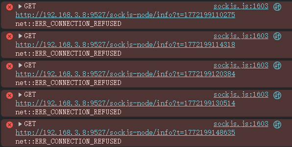
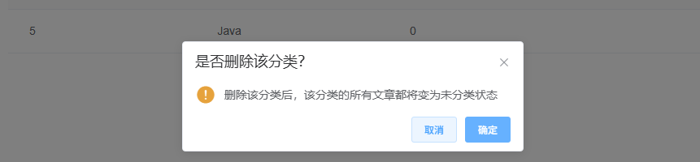
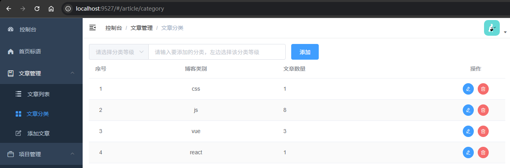

# L12：实现文章列表管理页（二）——文章分类页

本节录制时间：`2021-7-22 9:04:00`。

---


本节主要实现文章分类管理页，具体功能如下：

- 文章分类列表的渲染（不带分页）；
- 分类等级下拉框效果；
- 具体分类的编辑对话框；
- 具体分类的删除（包括文章列表中所属分类的联动效果）。


## 1 要点梳理

### 1.1 sockjs 的控制台报错问题

项目断开后，控制台报 `sockjs` 异常：



解决方案：禁用 `mysite-backend\node_modules\sockjs-client\dist\sockjs.js` 第 `L1603` 行（`L2`）：

```js
  try {
    // self.xhr.send(payload);
  } catch (e) {
    self.emit('finish', 0, '');
    self._cleanup(false);
  }
```


### 1.2 关于下拉框的回显异常

原因：双向绑定的值类型与 `value` 的值类型不一致：

```html
<el-select
  slot="prepend"
  v-model.number="order"
  placeholder="请选择分类等级"
>
  <el-option label="一级" :value="1" />
  <el-option label="二级" :value="2" />
  <el-option label="三级" :value="3" />
  <el-option label="四级" :value="4" />
  <el-option label="五级" :value="5" />
</el-select>
```


### 1.3 编辑分类信息时无需再次请求

由于列表中已经包含单条分类的所有字段信息，不用像视频中的做法用分类 `ID` 请求后端接口，直接将其传入对话框组件即可：

```js
// <el-button type="primary" @click="editCategory(row)" />
methods: {
  async editCategory(data) {
    // 这步可以省略，因为已经有了完整的分类数据：
    // const { data } = await getBlogCategory(id);
    this.category = { ...data }
    this.editVisible = true
  },
},
```


### 1.4 删除逻辑的优化

视频中只要点击删除就会弹对话框确认：



然而对于新增的分类本就没有相关的博客文章，这类提示信息有失准确。


## 2 实测备忘

效果图：




:one: 实测修改功能时，由于传参格式错误导致后台报 `500` 异常。应该按后端接口严格组装请求参数（`L5`）：

```js
methods: {
  async handleSubmit(data) {
    this.category = data
    this.loading = true
    await updateCategory({ id: data.id, data })
    await this.fetchCategories() // 刷新列表
    this.editVisible = false
    this.loading = false
  },
}
```


:two: 由于本节涉及分类信息 `blogType` 集合的数据变更，实测时最好将备份数据提前准备好，以便一键还原：

```bash
mongorestore -h "localhost:27017" -d "mysite" --dir "F:\mydesktop\mysiteDB" --drop
```

对应的还原数据已放到本节 `mysiteDB` 目录下。


:three: 顶部的分类等级下拉框有一段 `placeholder` 占位文字，设计页面时应留够宽度：

```css
.el-select {
  width: 150px;
}
```

注意：尽量写一级样式（不嵌套或尽可能少地嵌套选择器），方便后期做 `CSS` 压缩。
