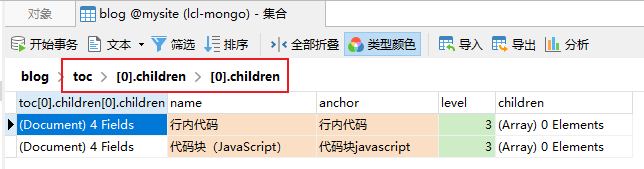
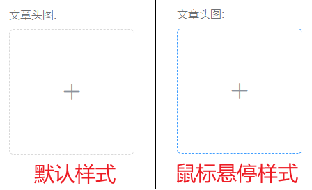
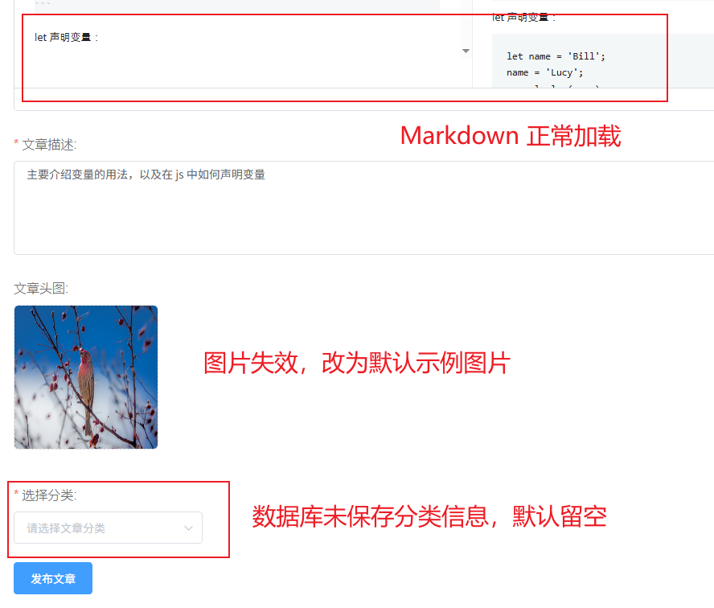
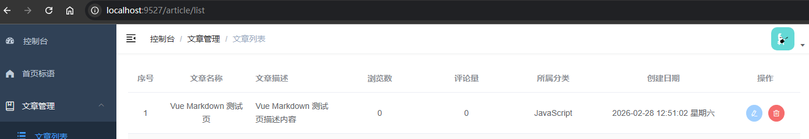
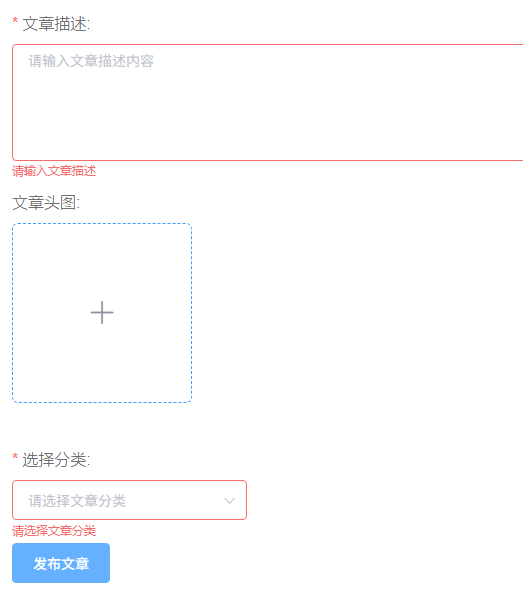
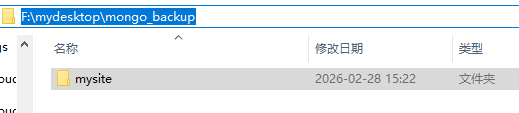
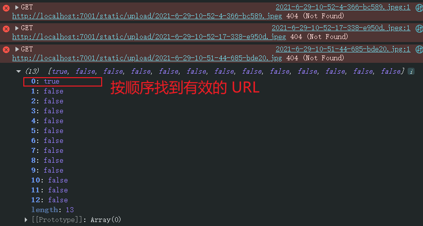
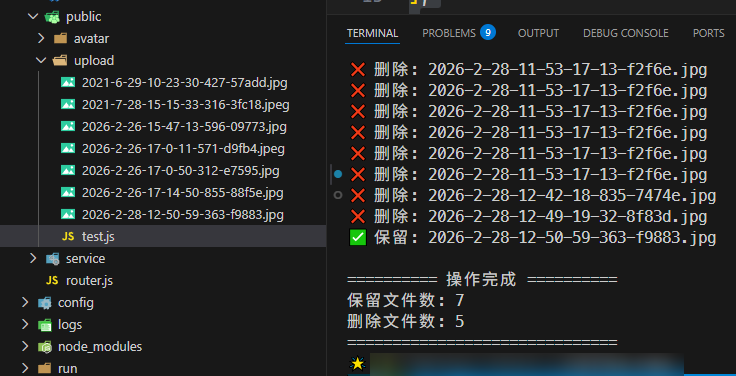

# L13：实现文章详情页（一）——文章的添加与编辑修改

本节录制时间：`2021-7-22 11:06:00`。

---


> [!tip]
>
> 本节主要实现博客文章的添加与编辑（内容加载）。核心功能为 `ToastUI Editor`：
>
> - `GitHub`：https://github.com/nhn/tui.editor
> - `NPM`：https://www.npmjs.com/package/@toast-ui/vue-editor
> - `Site`：https://ui.toast.com/
>
> PS：实测时新增了编辑页的表单校验逻辑。


## 1 要点梳理

### 1.1 关于 toc 字段的上传

后端接口传参逻辑（`ApiFox` 没写）：将文章 `Markdown` 原始正文内容通过 `markdownContent` 字段传入，服务器将自行合成对应的 `toc` 字段内容并保存入库：

实测 `toc` 字段入库情况：




### 1.2 关于 Vue 组件样式不生效的问题

带作用域标记（`scoped`）的样式在后台页面全部不生效，需要添加 `::v-deep` 标记进行样式透传：

```html
<style scoped>
::v-deep .el-form-item__label {
  float: none;
  font-size: 1em;
  font-weight: 100;
  user-select: none;
}
::v-deep .el-form-item__label::after {
  content: ":";
  clear: right;
}
</style>
```

上述样式可让 `label` 标签和表单字段各占一行（默认在同一行显示）。


### 1.3 图片上传组件的边框样式

视频提到上传组件的边框需要阅读源码才能修复，其实问题也是作用域样式导致的。直接在 `Upload` 组件中补充 `::v-deep` 标记即可：

```css
::v-deep .avatar-uploader .el-upload {
  border: 1px dashed #d9d9d9;
  border-radius: 6px;
  cursor: pointer;
  position: relative;
  overflow: hidden;
}
::v-deep .avatar-uploader .el-upload:hover {
  border-color: #409eff;
}
::v-deep .avatar-uploader-icon {
  font-size: 28px;
  color: #8c939d;
  width: 178px;
  height: 178px;
  line-height: 178px;
  text-align: center;
}
::v-deep .avatar {
  width: 178px;
  height: 178px;
  display: block;
}
```

最终效果：



另外，`Upload` 组件的宽度默认为容器宽度的 `100%`，这里改为 `width: fit-content;` 即可：

```html
<el-form-item label="文章头图">
  <upload v-model="data.thumb" style="width: fit-content" />
</el-form-item>
```


### 1.4 隐藏编辑文章的路由项

使用 `hidden` 属性（`L7`）：

```js
export const constantRoutes = [
  {
    path: 'edit/:id',
    name: 'ArticleEdit',
    component: () => import('@/views/articleEdit/index'),
    meta: { title: '编辑文章', icon: 'edit', auth: true },
    hidden: true
  }
]
```


### 1.5 图片 URL 的有效性检测

使用 `Image` 实例检测数据库中的图片 `URL` 是否有效：

```js
function checkImage(url) {
  return new Promise((resolve) => {
    const img = new Image()
    
    img.onload = () => resolve(true)  // 加载成功
    img.onerror = () => resolve(false) // 加载失败
    
    img.src = url
  })
}

getBlogDetail(blogId)
  .then(async (res) => {
    const validImg = await checkImage(blogData.thumb);
    this.data.thumb = validImg ? blogData.thumb : this.thumb;
  })
  .catch((err) => {
    console.error(err);
    this.$message.error("加载文章详情失败:" + err.message);
  })
  .finally(() => {
    this.loading = false;
  });
```

效果图：




## 2 实测备忘

效果图：



添加表单校验逻辑：




### :star: :star: :star: 关于代码、图片去重及 MongoDB 数据备份的三方同步

实测过程中，代码、图片、数据库最好能在同步状态下提交到 `Git` 版本库中，以便快速复原练习时的状态。总共分三步：

:one: 代码同步：避开所有 `node_modules` 目录，外加 `mysite-server` 后端产生的日志文件（位于 `logs` 文件夹下）；

:two: 数据库同步：利用 `MongoDB` 自带的命令行工具 `mongodump` 快速备份所有数据：

```bash
mongodump --host 127.0.0.1 --port 27017 --db mysite --out F:\mydesktop\mongo_backup
```

这样会在 `F:\mydesktop\mongo_backup` 目录下看到导出的所有数据库文件：



:three: 图片去重同步：先用一段 `JS` 排查所有无效的 `URL`：

```js
const arr = [
    '/static/upload/2026-2-28-12-50-59-363-f9883.jpg',
    '/static/upload/2021-8-11-9-27-0-533-2f8b5.jpeg',
    '/static/upload/2021-8-11-11-11-31-65-03337.jpeg',
    '/static/upload/2021-8-11-10-58-42-350-5a82b.jpeg',
    '/static/upload/2021-7-28-17-26-56-252-8efa6.webp',
    '/static/upload/2021-7-28-15-19-40-633-a236a.jpeg',
    '/static/upload/2021-7-28-15-18-27-124-11cba.jpeg',
    '/static/upload/2021-7-2-14-42-58-31-36015.jpeg',
    '/static/upload/2021-6-29-14-10-15-731-d8dd3.jpg',
    '/static/upload/2021-6-29-13-34-8-859-efb34.jpeg',
    '/static/upload/2021-6-29-10-52-4-366-bc589.jpeg',
    '/static/upload/2021-6-29-10-52-17-338-e950d.jpeg',
    '/static/upload/2021-6-29-10-51-44-685-bde20.jpg'
];
const brr = arr.map(url=>`http://localhost:7001${url}`)
  .map(url => {
    return new Promise((resolve) => {
      const img = new Image()
      img.onload = () => resolve(true) // 加载成功
      img.onerror = () => resolve(false) // 加载失败
      img.src = url
    })
  });
Promise.all(brr).then(console.log);
```

然后定位有效的 `URL`：



再利用 `DeepSeek` 提供的去重脚本清除所有冗余图片：

```js
const fs = require("node:fs").promises;
const path = require("node:path");

// 需要保留的文件列表
const filesToKeep = [
  "2026-2-26-17-0-11-571-d9fb4.jpeg",
  "2021-7-28-15-15-33-316-3fc18.jpeg",
  "2021-6-29-10-23-30-427-57add.jpg",
  "2026-2-26-17-0-50-312-e7595.jpg",
  "2026-2-26-15-47-13-596-09773.jpg",
  "2026-2-26-17-14-50-855-88f5e.jpg",
  "2026-2-28-12-50-59-363-f9883.jpg",
];

// 将保留的文件列表转换为Set，方便快速查找
const keepSet = new Set(filesToKeep);

async function cleanImages() {
  try {
    // 获取当前文件夹下的所有文件
    const files = await fs.readdir(process.cwd());

    // 过滤出所有.jpg和.jpeg文件
    const imageFiles = files.filter((file) => {
      const ext = path.extname(file).toLowerCase();
      return ext === ".jpg" || ext === ".jpeg";
    });

    console.log(`找到 ${imageFiles.length} 个图片文件`);

    let deletedCount = 0;
    let keptCount = 0;

    // 遍历所有图片文件
    for (const file of imageFiles) {
      // 检查文件是否在保留列表中
      if (keepSet.has(file)) {
        console.log(`✅ 保留: ${file}`);
        keptCount++;
      } else {
        try {
          // 删除文件
          await fs.unlink(path.join(process.cwd(), file));
          console.log(`❌ 删除: ${file}`);
          deletedCount++;
        } catch (err) {
          console.error(`删除失败 ${file}:`, err.message);
        }
      }
    }

    console.log("\n========== 操作完成 ==========");
    console.log(`保留文件数: ${keptCount}`);
    console.log(`删除文件数: ${deletedCount}`);
    console.log("==============================");
  } catch (err) {
    console.error("执行过程中出现错误:", err);
  }
}

// 执行清理函数
cleanImages();
```

将该脚本文件存到 `upload` 目录下，例如 `test.js`，运行 `node test.js` 清除冗余图片：

实测执行情况：

```bash
node .\test.js
找到 12 个图片文件
✅ 保留: 2021-6-29-10-23-30-427-57add.jpg 
✅ 保留: 2021-7-28-15-15-33-316-3fc18.jpeg
✅ 保留: 2026-2-26-15-47-13-596-09773.jpg 
✅ 保留: 2026-2-26-17-0-11-571-d9fb4.jpeg 
✅ 保留: 2026-2-26-17-0-50-312-e7595.jpg  
✅ 保留: 2026-2-26-17-14-50-855-88f5e.jpg 
❌ 删除: 2026-2-28-11-16-51-730-7da7e.jpg 
❌ 删除: 2026-2-28-11-52-7-297-d65f0.jpg  
❌ 删除: 2026-2-28-11-53-17-13-f2f6e.jpg
❌ 删除: 2026-2-28-11-53-17-13-f2f6e.jpg
❌ 删除: 2026-2-28-11-53-17-13-f2f6e.jpg
❌ 删除: 2026-2-28-11-53-17-13-f2f6e.jpg
❌ 删除: 2026-2-28-11-53-17-13-f2f6e.jpg
❌ 删除: 2026-2-28-11-53-17-13-f2f6e.jpg
❌ 删除: 2026-2-28-11-53-17-13-f2f6e.jpg
❌ 删除: 2026-2-28-11-53-17-13-f2f6e.jpg
❌ 删除: 2026-2-28-11-53-17-13-f2f6e.jpg
❌ 删除: 2026-2-28-11-53-17-13-f2f6e.jpg
❌ 删除: 2026-2-28-12-42-18-835-7474e.jpg
❌ 删除: 2026-2-28-12-49-19-32-8f83d.jpg
✅ 保留: 2026-2-28-12-50-59-363-f9883.jpg

========== 操作完成 ==========
保留文件数: 7
删除文件数: 5
==============================
```




