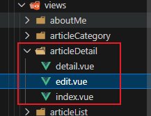
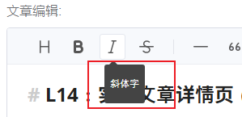

# L14：实现文章详情页（二）——优化文章的添加与编辑

本节录制时间：`2021-7-23 13:06:00`。

---


本节主要实现文章新增页与编辑页的合并，以及其他细节优化。


## 1 要点梳理

### 1.1 Toast UI Editor 的地区与语言配置

```js
/*<editor
  ref="toastuiEditor"
  :initial-value="data.content"
  :options="editorOptions"
  height="500px"
  initial-edit-type="markdown"
  preview-style="vertical"
/> */

import '@toast-ui/editor/dist/toastui-editor.css'
import { Editor } from '@toast-ui/vue-editor'
// 引入语言样式
import '@toast-ui/editor/dist/i18n/zh-cn'

export default {
  name: 'ArticleDetail',
  components: {
    Editor,
  },
  data() {
    return {
      editorOptions: {
        language: 'zh-CN' // 配置指定语言
      },
    }
  }
}
```

配置文档详见：https://nhn.github.io/tui.editor/latest/tutorial-example16-i18n


### 1.2 提取文章详情公共组件

文章的新增和修改页面存在大量重复代码，可以重构出公共组件进行优化：

重构后的目录结构：



相应地，路由配置也必须同步：

```js
// ./src/router/index.js
export const constantRoutes = [
  {
    path: 'add',
    name: 'ArticleAdd',
    component: () => import('@/views/articleDetail/index'),
    meta: { title: '添加文章', icon: 'edit', auth: true }
  },
  {
    path: 'edit/:id',
    name: 'ArticleEdit',
    component: () => import('@/views/articleDetail/edit'),
    meta: { title: '编辑文章', icon: 'edit', auth: true },
    hidden: true
  }
];
```


## 2 实测备忘

效果图：



重构后的新增页面：

```vue
<template>
  <div class="article-add-container">
    <article-detail mode="add" />
  </div>
</template>

<script>
import ArticleDetail from './detail.vue'

export default {
  name: 'ArticleAdd',
  components: {
    ArticleDetail
  }
}
</script>

<style scoped></style>
```

重构后的修改页面：

```vue
<template>
  <div class="article-edit-container">
    <article-detail mode="edit" />
  </div>
</template>

<script>
import ArticleDetail from './detail.vue'

export default {
  name: 'ArticleEdit',
  components: {
    ArticleDetail
  }
}
</script>

<style scoped></style>
```


备份数据库命令（详见 `mysiteDB.zip`）：

```bash
mongodump --host 127.0.0.1 --port 27017 --db mysite --out F:\mydesktop\mongo_backup
```

备份图片去重脚本（详见 `dedup_images.js`）：

```js
const fs = require("node:fs").promises;
const path = require("node:path");

// 需要保留的文件列表
const filesToKeep = [
  "2026-2-26-17-0-11-571-d9fb4.jpeg",
  "2021-7-28-15-15-33-316-3fc18.jpeg",
  "2021-6-29-10-23-30-427-57add.jpg",
  "2026-2-26-17-0-50-312-e7595.jpg",
  "2026-2-26-15-47-13-596-09773.jpg",
  "2026-2-26-17-14-50-855-88f5e.jpg",
  "2026-2-28-12-50-59-363-f9883.jpg",
];

// 将保留的文件列表转换为Set，方便快速查找
const keepSet = new Set(filesToKeep);

async function cleanImages() {
  try {
    // 获取当前文件夹下的所有文件
    const files = await fs.readdir(process.cwd());

    // 过滤出所有.jpg和.jpeg文件
    const imageFiles = files.filter((file) => {
      const ext = path.extname(file).toLowerCase();
      return ext === ".jpg" || ext === ".jpeg";
    });

    console.log(`找到 ${imageFiles.length} 个图片文件`);

    let deletedCount = 0;
    let keptCount = 0;

    // 遍历所有图片文件
    for (const file of imageFiles) {
      // 检查文件是否在保留列表中
      if (keepSet.has(file)) {
        console.log(`✅ 保留: ${file}`);
        keptCount++;
      } else {
        try {
          // 删除文件
          await fs.unlink(path.join(process.cwd(), file));
          console.log(`❌ 删除: ${file}`);
          deletedCount++;
        } catch (err) {
          console.error(`删除失败 ${file}:`, err.message);
        }
      }
    }

    console.log("\n========== 操作完成 ==========");
    console.log(`保留文件数: ${keptCount}`);
    console.log(`删除文件数: ${deletedCount}`);
    console.log("==============================");
  } catch (err) {
    console.error("执行过程中出现错误:", err);
  }
}

// 执行清理函数
cleanImages();
```

