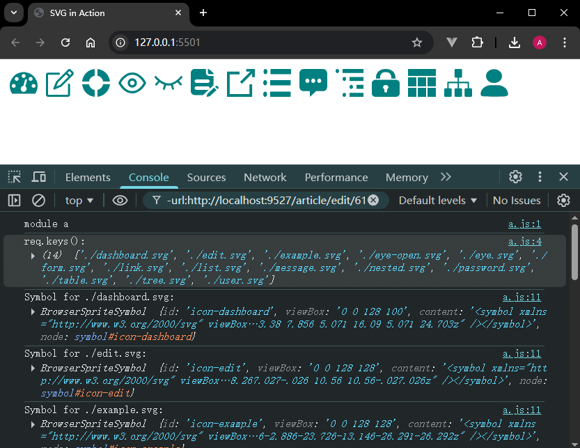
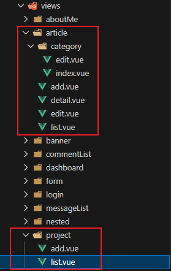
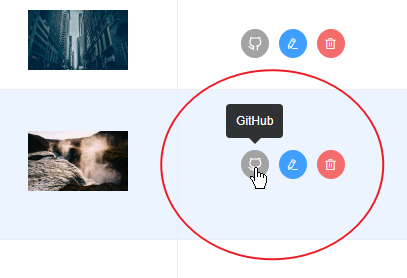
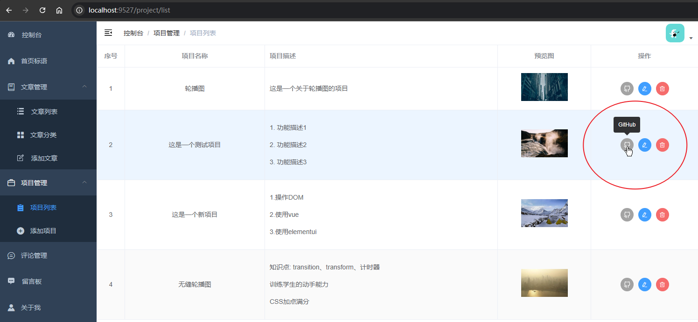

# L15：实现项目管理模块——增、删、改、查

本节录制时间：`2021-07-23 19:57:54`。

---


> [!tip]
>
> **内容概要**
>
> 本节是对包含 `CRUD` 功能模块的再次强化，以项目管理模块为例，集中练习项目的——
>
> - 列表渲染：带数组值的字段渲染、扩充 `SVG` 图标、项目配图预览等；
> - 编辑页：用全屏对话框回填字段值并提交表单；
> - 删除操作：确认后再删除。
>
> 由于个人博客的项目数普遍偏少，这里不考虑分类查询。


## 1 要点梳理

### 1.1 SVG 图标扩展

标准 `SOP`：

1. 从 `iconfont.cn` 下载 `GitHub` 图标的 `SVG` 格式文件，放到后台项目指定的文件夹（`mysite-backend/src/icons/svg/github.svg`）；
2. 运行命令 `npm run svgo` 压缩图标（实际执行命令：`svgo -f src/icons/svg --config=src/icons/svgo.yml`）；
3. 使用新图标：`<el-button icon="github" />`。

相关文档资源：

- `vue-element-admin` 图标文档：https://panjiachen.github.io/vue-element-admin-site/zh/guide/advanced/icon.html
- `SvgIcon` 组件的用法：https://panjiachen.github.io/vue-element-admin-site/zh/feature/component/svg-icon.html#svg-icon-%E5%9B%BE%E6%A0%87
- [手摸手，带你优雅的使用 icon](https://juejin.cn/post/6844903517564436493)
- [未来必热：SVG Sprite技术介绍](https://www.zhangxinxu.com/wordpress/2014/07/introduce-svg-sprite-technology/)
- 全面对比 `SVG` 与 `IconFont` 字体：[CSS-TRICKS: Inline SVG vs Icon Fonts [CAGEMATCH]](https://css-tricks.com/icon-fonts-vs-svg/)
- `SVGO` 源码：https://github.com/svg/svgo（)
- :star: 关于 `require.context()` 在 `SvgIcon` 组件中批量导入 `SVG` 图标模块的写法的验证，详见 `DIY` 练手项目 `svg-demo`。

实测效果：




### 1.2 按 vue-element-admin 演示项目重构文件夹结构

按功能模块重新规划文章管理和个人项目管理的目录结构，使其更加紧凑：




### 1.3 使用框架自带的 SvgIcon 组件

根据框架的最佳实践，新增图标可以使用 `SvgIcon` 组件：

```vue
<template>
  <el-button
    circle
    size="mini"
    class="btn-gh"
    @click="gotoGithub(row)"
  >
    <svg-icon icon-class="github" class-name="gh" />
  </el-button>
</template>
<style lang="scss" scoped>
.gh {
  transform: scale(1.2);
}
.btn-gh {
  color: white;
  background-color: rgb(163, 163, 163);
  border-color: rgb(163, 163, 163);
}
</style>
```

实测效果图：




### 1.4 关于数组型字段的渲染

列表数据中的 `data.description` 是一个数组，渲染时用 `v-for` 指令生成多个 `p` 段落：

```vue
<el-table-column prop="description" label="项目描述">
  <template v-slot="{ row }">
    <p v-for="(desc, idx) in row.description" :key="idx">{{ desc }}</p>
  </template>
</el-table-column>
```




## 2 增补：前台接入正式接口

本套课程少了重要一环，就是前台接口禁用测试数据，换用后端真实数据的具体操作。

:one: 首先禁用 `mock` 数据（`L8`）：

```js
// ./src/main.js:
import Vue from 'vue';
import App from './App.vue';
import router from './router';
import { getMessage } from '@/utils';
Vue.prototype.$getMessage = getMessage;

// import '@/mock';
```

:two: 根据实测情况，开发服务器的转发地址应统一改为 `http://localhost:7001`，同时图片等静态资源也要同步更新：

```js
// vue.config.js:
module.exports = {
  devServer: {
    proxy: {
      '/api': {
        target: 'http://localhost:7001',
      },
      '/static' : {
        target : 'http://localhost:7001'
      }
    },
  },
  configureWebpack: require('./webpack.config'),
}
```

:three: 其余就是一些细节调整：

先是图片更新——

- 将【首页标语】及【文章管理】的所有图片从后台系统重新上传（借助：`https://picsum.photos/400/300`）；
- 首页标语 `URL`（另存后上传 `mysite-server`）：
  - 屏1中图：http://mdrs.yuanjin.tech/img/20201031141507.jpg
  - 屏1大图：http://mdrs.yuanjin.tech/img/20201031141350.jpg
  - 屏2中图：http://mdrs.yuanjin.tech/img/20201031205550.jpg
  - 屏2大图：http://mdrs.yuanjin.tech/img/20201031205551.jpg
  - 屏3中图：http://mdrs.yuanjin.tech/img/20201031204401.jpg
  - 屏3大图：http://mdrs.yuanjin.tech/img/20201031204403.jpg

然后是文章列表及详情页的渲染调试——

从父容器 `Layout` 向子组件传 `data` 时，有些组件用到了 `computed` 计算属性。这些属性在首屏加载时拿不到 `data`，因此 **必须进行非空检查**，或者在 `template` 中使用 `v-if` 进行限定。


## 3 实测备忘

:one: 图片去重备份：经过逐表筛选，清理图片上传文件夹中的冗余文件后备份图片到 `L15_project_page/upload_backup.rar`（含去重脚本）。

:two: 最新数据库备份：

```bash
mongodump --host 127.0.0.1 --port 27017 --db mysite --out F:\mydesktop\mongo_backup
```

恢复方法：将备份数据解压到桌面 `mysiteDB` 文件夹，然后运行以下命令（先提前导出历史数据，否则全部丢失）：

```bash
mongorestore -h "localhost:27017" -d "mysite" --dir "F:\mydesktop\mysiteDB" --drop
```

:three: 代码备份：除 `node_modules` 文件夹以及后端接口的日志内容外，三个项目源码全部放到 `mysite` 目录下备份。