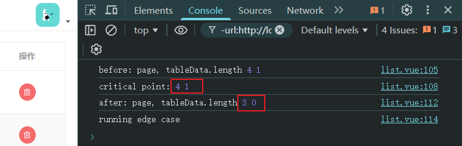
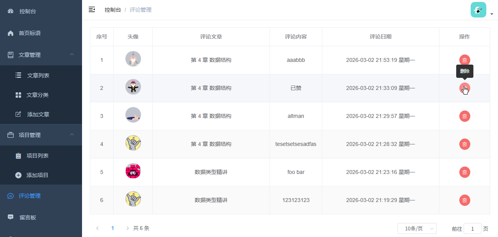
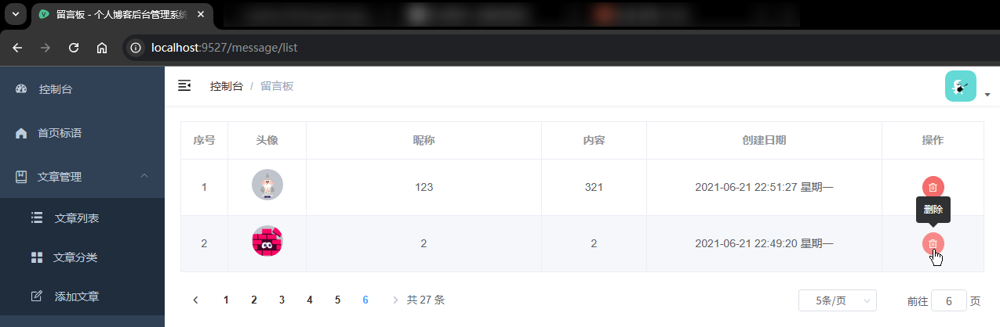

# L16：实现评论管理与留言板模块

录制时间：`2021-07-27 14:37:00`。

---


本节实现【评论管理】模块和【留言板】模块。


## 1 要点梳理

### 1.1 文章评论模块的两个疑点

【疑点一】疑因后端接口设计时，评论信息表和留言表共用 `messages` 集合，导致新增文章评论后无法正常刷新评论列表，后端报操作过于频繁。

【疑点二】当分页列表只剩一条数据时，若调用删除接口删除这条数据，然后再调分页查询接口刷新页面，此时的当前页码 `this.page` 会自动减一页，而返回的分页数据则为空。目前无法核实 **页码自动递减行为的确切来源**，原因可能有两个——

- `ElementUI` 组件的默认行为：受 `el-pagination` 的 `current-change` 事件影响；
- `mysite-server` 后台自动探测：若当前页面超过总页数，则自动和总页数保持一致。

调试代码（`L7` 至 `L14`）：

```js
removeComment(row) {
  this.loading = true
  this.$confirm('确定要删除该评论吗？', '提示', {
    type: 'warning'
  })
    .then(() => {
      console.log('before: page, tableData.length', this.page, this.tableData.length); // 2 1
      delComment(row.id).then(async() => {
        this.$message.success('评论已删除')
        console.log('critical point:', this.page, this.tableData.length); // 2 1, same as before
        await this.fetchComments()
        this.loading = false
        // 当前页仅剩一条数据，删除后会导致当前页没有数据，此时需要让页码回退到上一页
        console.log('after: page, tableData.length', this.page, this.tableData.length); // 1 0
        if (this.tableData.length === 0) {
          console.log('running edge case')
          this.fetchComments()
        }
      }).catch(err => {
        this.$message.error('删除评论失败' + err.message)
      })
    }).catch(() => {
      this.$message.info('已取消删除')
    }).finally(() => {
      this.loading = false
    })
}
```


### 1.2 留言板模块

除了具体接口不同外，其余页面逻辑几乎完全相同：分页列表、删除（带孤行控制）。

问题也一样，删除当前页面最后一条留言后，当前页码自动减一，原因不明。


## 2 实测备忘

留言板模块的孤行控制问题：



最终效果图：

文章评论列表：



留言板管理页：

