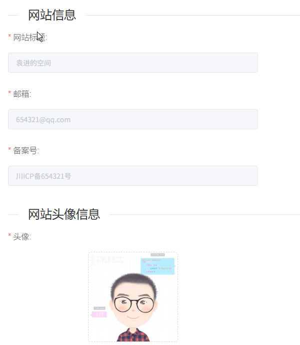
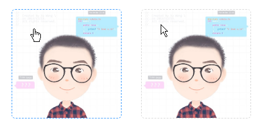
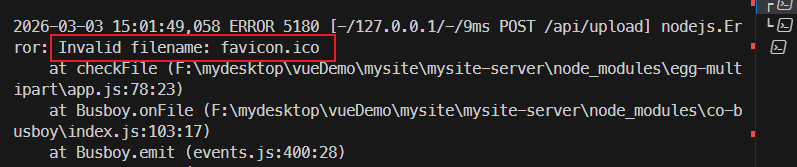

# L17：实现关于模块、系统设置模块、密码更新模块

本节录制时间：`2021-07-27 15:57:20`。

---


> [!tip]
>
> 本节实现本套课程功能模块的最后一部分：
>
> - 【关于】模块：用于查看或变更部署到外站的个人站点 `URL`；
> - 【（系统）设置】模块：即扩充版的【关于】模块，负责前台侧边栏下方的个人信息的维护；
> - 【个人中心】模块：入口位于右上角头像菜单项中，用于维护登录密码。练习重点：包含多个校验规则的表单字段的维护。


## 1 要点梳理

### 1.1 只存在一个文本框的表单的坑

> [!important]
>
> `W3C` 标准中有如下 [规定](https://www.w3.org/MarkUp/html-spec/html-spec_8.html#SEC8.2)：
>
> *When there is only one single-line text input field in a form, the user agent should accept Enter in that field as a request to submit the form.*
> 当一个 `form` 元素中只有一个输入框时，在该输入框中按下回车 **应提交该表单**。
>
> 如果希望阻止这一默认行为，可以在 `<el-form>` 标签上添加 `@submit.native.prevent`。

`DIY` 实现【关于】模块时想拓展一些实用效果，例如在按下回车键后，通过 `@keyup.enter.native="onSubmit"` 自动提交表单；但由于所在表单只包含这一个文本框，因此有默认提交行为干扰自定义逻辑。

解决方案：

```vue
<el-form ref="formRef"
  @submit.native.prevent
  :inline="true" 
  :model="formData" 
  :rules="rules"
>
  <el-form-item label="站点 URL" prop="url">
    <el-input ref="refAboutMe" class="about-me"
      v-model="formData.url"
      @keyup.enter.native="onSubmit" 
      :disabled="disabled" 
      placeholder="请输入站点 URL" 
    />
  </el-form-item>
</el-form>

<script>
export default {
  methods: {
    stopDefault() {}
  }
}
</script>
```


### 1.2 文本框解禁后自动得焦点效果

使用 `this.$nextTick()` 方法：

```js
onSubmit() {
  this.disabled = !this.disabled
  if (!this.disabled) {
    this.$nextTick(() => this.$refs.refAboutMe.focus());
    return;
  }
  // -- snip --
}
```


### 1.3 关于系统设置模块的改造

放弃视频中的手写 `div` 模式，改为 `el-form` 表单 + `el-form-item` 表单项的组合，外加 `el-divider` 水平分割线的效果：




### 1.4 关于上传图片组件的鼠标悬停样式

禁用 `el-form` 表单后，所有文本框也会自动禁用，但上传组件的鼠标悬停样式仍然是 `cursor: pointer;`。

解决方案：根据禁用状态自定义一个样式类 `noClick`，然后声明样式：

```css
/* <upload v-model="info.avatar" :class="{noClick: !editMode}"></upload> */
.noClick {
  pointer-events: none;
  user-select: none;
}
```

实测效果对比如下（左边为生效前，右边为生效后）：




### 1.5 关于分割线的使用

利用 `ElementUI` 内置的分割线组件可以很好地实现长表单不同区域的分割：

```html
<el-divider content-position="left">网站头像信息</el-divider>
```

分割线上的字体样式定制：字号和上下外边距最好保持一致（这样分割线才会与文字保持垂直居中渲染）：

```css
::v-deep .el-divider--horizontal {
  margin-block: 3.5em 1.5em;
}
::v-deep .el-divider--horizontal:first-child {
  margin-block-start: 1.5em;
}
.el-divider__text {
  font-size: 1.5em;
}
```


## 2 关于登录模块的 Bug

在实现密码修改模块时发现【登录模块】的 `Bug`：登录成功后应将有效的 `token` 同步写入 `store`，否则进入系统后发送 `getInfo()` 请求将没有缺少 `authrization` 请求头，从而导致获取登录用户信息失败（`L7`）：

```js
// @/utils/request.js:
// request interceptor
service.interceptors.request.use(
  config => {
    // do something before request is sent

    if (store.getters.token) {
      // let each request carry token
      // ['X-Token'] is a custom headers key
      // please modify it according to the actual situation
      // raw: config.headers['X-Token'] = getToken()
      config.headers['Authorization'] = `Bearer ${getToken()}`
    }
    return config
  },
  // -- snip --
}
```

解决方案：登录成功后将 `token` 写入 `store`（`L24`）：

```js
// @/store/modules/user.js:
const actions = {
  // user login
  login({ commit }, loginParams) {
    return new Promise((resolve, reject) => {
      userLogin(loginParams).then(resp => {
        // console.log(typeof resp, resp);
        if (typeof resp === 'string') {
          // invalid captcha
          reject(JSON.parse(resp).msg) // resp: '{"code":406,"msg":"验证码错误","data":null}'
          return
        }

        if (!resp.data) { // resp: {code: 0, msg: '', data: null}
          // invalid loginId / loginPwd
          reject('用户名或密码错误！')
          return
        }

        // resp: {code: 0, msg: '', data: {id:'xxxx', loginId: 'admin', name: '管理员'}}
        const { data } = resp
        commit('SET_USER', data)
        commit('SET_NAME', data.name)
        commit('SET_TOKEN', getToken()) // Bug: Now, the token has been written into localStorage by response interceptor
        commit('SET_AVATAR', 'https://wpimg.wallstcn.com/f778738c-e4f8-4870-b634-56703b4acafe.gif')
        resolve()
      }).catch(reject)
    })
  },
  // -- snip --
}
```


## 3 实测备忘

:one: 实测时未采用全屏对话框的形式单独编辑系统设置信息（太丑）。

:two: 要让上传图片组件和其他文本框居中对齐，可以利用 `Flexbox` 实现：

```scss
$width: 500px;
.form-field {
  width: $width;
}
.upload-container {
  width: $width;
  display: flex;
  justify-content: center;
}
```

最终效果：


:three: 后端 `Bug`：`mysite-server` 没有考虑网站图标的标准格式(`.ico`)，导致首次上传失败：



解决方案：修改默认的扩展名白名单（`{PROJ_BASE}/mysite-server/config/config.default.js`，第 `L15` 行）：

```js
// multipart for uploaders
exports.multipart = {
  fileSize: '2mb', // max size 2mb
  whitelist: [
    // images
    '.jpg',
    '.jpeg', // image/jpeg
    '.png', // image/png, image/x-png
    '.gif', // image/gif
    '.bmp', // image/bmp
    '.wbmp', // image/vnd.wap.wbmp
    '.webp',
    '.tif',
    'svg',
    '.ico'
  ],
  mode: 'file',
  tmpdir: path.resolve(__dirname, '../app', './public', 'upload_temp'),
};
```

相应地，页面 `Upload` 组件的扩展名校验逻辑也要新增 `.ico` 格式：

```js
data() {
  return {
    validMIMEType: [
      'image/jpeg',
      'image/png',
      'image/x-icon', // ico 格式的一种 MIME 类型
      'image/vnd.microsoft.icon', // ico 格式的另一种 MIME 类型
      'image/ico' // 某些系统可能使用的 ico MIME 类型
    ]
  }
},
beforeAvatarUpload(file) {
  const validMIME = this.validMIMEType.includes(file.type)
  const isLt2M = file.size / 1024 / 1024 < 2

  if (!validMIME) {
    this.$message.error('只能上传 JPG/PNG/ICO 格式的图片!')
  }
  if (!isLt2M) {
    this.$message.error('上传图片大小不能超过 2MB!')
  }
  return validMIME && isLt2M
}
```


:four: 修复登录 `Bug` 后，顺便实现登录页的几处微调：

- 验证码输错后不清空用户名和密码；
- 验证码输错后直接定位到验证码文本框。

核心逻辑：

```js
updateCaptcha() {
  getCaptcha().then((captcha) => {
    this.captcha = captcha
    this.$nextTick(() => this.$refs.captchaInput.focus())
  })
},
```


