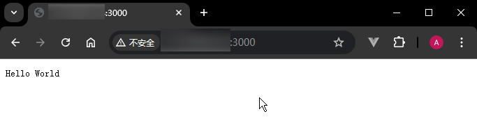
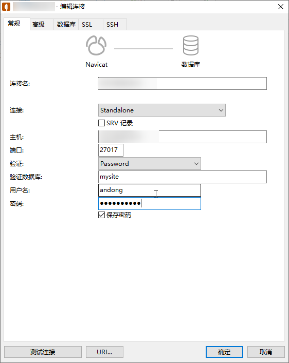
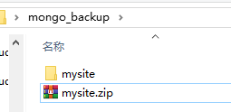
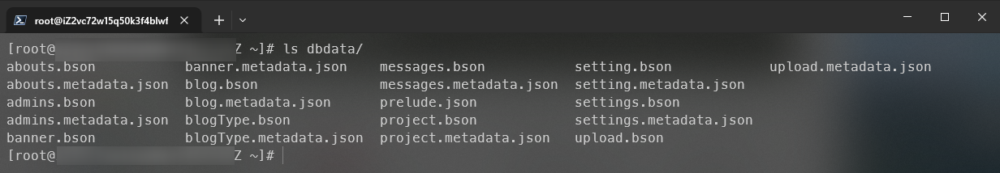
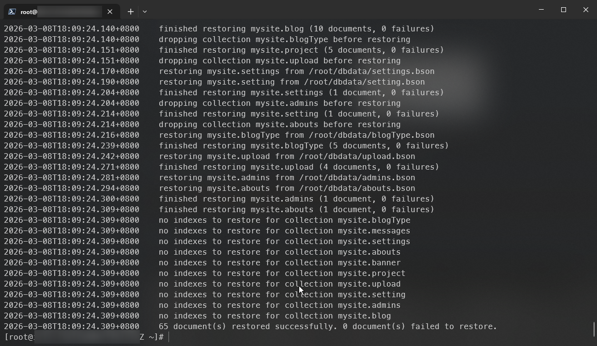
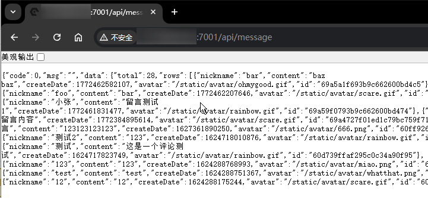

# L18：将项目部署到阿里云

本节录制时间：

- `L18-1`：`2021-08-04 21:04:50`（项目部署介绍）；
- `L18-2`：`2021-08-04 23:32:48`（购买阿里云服务器）；
- `L18-3`：`2021-08-05 13:30:45`（安装 `Node.js`）；
- `L18-4`：`2021-08-05 13:38:40`（安装 `MongoDB`）；
- `L18-5`：`2021-08-05 14:26:38`（上传服务器代码和回复数据库数据）；
- `L18-6`：`2021-08-05 15:04:08`（安装 `Nginx`）；
- `L18-7`：`2021-08-05 15:27:46`（上传静态资源）；
- `L18-8`：`2021-08-11 14:53:11`（守护进程）；
- `L18-9`：`2021-08-11 15:10:16`（域名映射）；
- `L18-10`：`2021-08-12 10:45:33`（数据库远程连接加密）；


本篇为阿里云服务器部署 `Vue2` 个人博客项目的实测备忘录。


## 1 部署 NodeJS 环境

安装向导：https://help.aliyun.com/document_detail/50775.html

安装 `NodeJS` 版本：`v14.21.3`

具体操作：

:one: `ssh` 远程连接到阿里云服务器：

```bash
# 格式：ssh <user_name>@<host_ip>
ssh root@12.345.678.901
```

:two: 安装 `Git`：

```bash
sudo yum install git -y
```

:three: 安装 `nvm`：

```bash
git clone https://gitee.com/mirrors/nvm.git ~/.nvm && cd ~/.nvm && git checkout `git describe --abbrev=0 --tags`
```

其中的 `git describe --abbrev=0 --tags` 用于获取最新的 `tag` 标签名称。

然后配置 `nvm` 环境变量：

```shell
sudo sh -c 'echo ". ~/.nvm/nvm.sh" >> /etc/profile'
source /etc/profile
```

再切换镜像源为阿里云镜像：

```bash
export NVM_NODEJS_ORG_MIRROR=https://npmmirror.com/mirrors/node
```

最后安装指定版本的 `NodeJS`：

```bash
nvm install v14.21.3
```

:four: 编写验证脚本 `example.js`：

```js
const http = require('http');
const hostname = '0.0.0.0';
const port = 3000;
const server = http.createServer((req, res) => {
    // 设置状态码为200
    res.statusCode = 200;
    // 设置内容类型为纯文本
    res.setHeader('Content-Type', 'text/plain');
    // 添加Cache-Control头部，禁止缓存
    res.setHeader('Cache-Control', 'no-store, no-cache, must-revalidate, max-age=0');
    // 添加Pragma头部，禁止缓存（为了兼容旧版浏览器）
    res.setHeader('Pragma', 'no-cache');
    // 设置Expires头部为一个过去的日期，使内容立即过期。或者使用具体的过期日期，如 'Expires: Tue, 03 Jul 2001 06:00:00 GMT'
    res.setHeader('Expires', '0'); 
    // 发送响应体
    res.end('Hello World\n');
});
// 监听指定的端口和主机名
server.listen(port, hostname, () => {
    console.log(`Server running at http://${hostname}:${port}/`);
});
```

:five: 在 `ECS` 实例的安全组中，添加入方向规则，放行项目中配置的端口号 `3000`：


打开本地浏览器并访问 `http://<IP_addr>:3000`：




## 2 安装 MongoDB

本节第一版课件已失效，应使用 `MongoDB` 官方源进行安装（`DeepSeek` 全称指导）：

```shell
# 首次尝试失败：
sudo vim /etc/yum.repos.d/mongodb-org.repo
# 文件内容如下：
[mongodb-org-7.0]
name=MongoDB Repository
baseurl=https://mirrors.aliyun.com/mongodb/yum/redhat/8/mongodb-org/7.0/x86_64/
gpgcheck=0
enabled=1
# 尝试安装（失败）：
sudo yum install -y mongodb-org
MongoDB Repository                                                                      129 kB/s |  87 kB     00:00
Errors during downloading metadata for repository 'mongodb-org-7.0':
  - Downloading successful, but checksum doesn't match. Calculated: dc883be73ad0fbe9bd54f04d57211aaf2145d1be26468e62a6bc7ba14761066c(sha256)  Expected: 3aa41eecfa7928c9fb740bbe9cdfb2948bd76b26cde008cdcc1ce5df523c8eaf(sha256)
  - Downloading successful, but checksum doesn't match. Calculated: 4be2bd18a181843b502a4d32ecf5a7b85a47743f57cb060900cdf325637dfe31(sha256)  Expected: 7ba89ebba36a86fef560ceffca5f3922d716357dbc52a66e09ac63d412d8ec0d(sha256)
Error: Failed to download metadata for repo 'mongodb-org-7.0': Yum repo downloading error: Downloading error(s): repodata/primary.xml.gz - Cannot download, all mirrors were already tried without success; repodata/filelists.xml.gz - Cannot download, all mirrors were already tried without success
#################################################

# 第二次尝试（成功）
# 1. 清理 yum 缓存
sudo yum clean all
# 2. 删除之前配置的阿里云 MongoDB 仓库文件
sudo rm -f /etc/yum.repos.d/mongodb-org.repo
# 重新配置 MongoDB 官方 yum 仓库：
sudo vim /etc/yum.repos.d/mongodb-org.repo
# 内容如下：
[mongodb-org-7.0]
name=MongoDB Repository
baseurl=https://repo.mongodb.org/yum/redhat/8/mongodb-org/7.0/x86_64/
gpgcheck=1
enabled=1
gpgkey=https://pgp.mongodb.com/server-7.0.asc
# 从 yum 安装
sudo yum install -y mongodb-org
# 启动并验证安装：
#   1. 启动 MongoDB 服务
sudo systemctl start mongod
#   2. 设置开机自启
sudo systemctl enable mongod
#   3. 查看服务状态，确认是否成功启动
sudo systemctl status mongod
# 查看状态报错：
● mongod.service - MongoDB Database Server
   Loaded: loaded (/usr/lib/systemd/system/mongod.service; enabled; vendor preset: disabled)
   Active: failed (Result: exit-code) since Thu 2026-03-05 02:36:29 CST; 27s ago
     Docs: https://docs.mongodb.org/manual
 Main PID: 2029 (code=exited, status=14)

Mar 05 02:36:28 iZ2vcabcde5q50k3f4blwfwZ systemd[1]: Started MongoDB Database Server.
Mar 05 02:36:29 iZ2vcabcde5q50k3f4blwfwZ mongod[2029]: {"t":{"$date":"2026-03-04T18:36:29.112Z"},"s":"I",  "c":"CONTROL">
Mar 05 02:36:29 iZ2vcabcde5q50k3f4blwfwZ systemd[1]: mongod.service: Main process exited, code=exited, status=14/n/a
Mar 05 02:36:29 iZ2vcabcde5q50k3f4blwfwZ systemd[1]: mongod.service: Failed with result 'exit-code'.
lines 1-10/10 (END)
```

报错原因：从日志来看，MongoDB 启动失败的核心原因是它无法操作 **/tmp/mongodb-27017.sock** 这个 socket 文件：

```bash
Failed to unlink socket file /tmp/mongodb-27017.sock: Operation not permitted
```

解决方案：

```bash
# 首先，查看该文件的属主和权限：
ls -l /tmp/mongodb-27017.sock
# 删除该文件
sudo rm -f /tmp/mongodb-27017.sock
# 重新启动 MongoDB 服务并验证安装：
#   1. 启动 MongoDB 服务
sudo systemctl start mongod
#   2. 设置开机自启
sudo systemctl enable mongod
#   3. 查看服务状态，确认是否成功启动
sudo systemctl status mongod
# 安装成功
```


### 2.1 为 MongoDB 配置密码及权限

修改安全策略，仅运行本地 `IP` 访问云服务器，并放开 `27017` 端口以便 `Navicat` 远程连接。

然后 `ssh` 建立连接，设置密码、权限如下：

```bash
# 用命令行连接数据库
mongo
> use admin
> db.createUser({user:"root",pwd:"123456",roles:[{role:"userAdminAnyDatabase",db: "admin"}]})
> use amdin
> db.auth("root","123456")
1
> use mysite
> db.createUser({user:"andong",pwd:"123456",roles:[{role:"read",db: "mysite"},{role:"readWrite",db:"mysite"}]})
> db.auth("andong","123456")
1
```

然后修改 `MongoDB` 系统配置文件，放开所有 `IP` 访问（即 `L28`。起初尝试改为本地 `IP`，结果 `MongoDB` 始终无法正常启动）：

```bash
# mongod.conf

# for documentation of all options, see:
#   http://docs.mongodb.org/manual/reference/configuration-options/

# where to write logging data.
systemLog:
  destination: file
  logAppend: true
  path: /var/log/mongodb/mongod.log

# Where and how to store data.
storage:
  dbPath: /var/lib/mongo
  journal:
    enabled: true
#  engine:
#  wiredTiger:

# how the process runs
processManagement:
  timeZoneInfo: /usr/share/zoneinfo

# network interfaces
net:
  port: 27017
  # bindIp: 127.0.0.1  # Enter 0.0.0.0,:: to bind to all IPv4 and IPv6 addresses or, alternatively, use the net.bindIpAll setting.
  bindIp: 0.0.0.0  # Enter 0.0.0.0,:: to bind to all IPv4 and IPv6 addresses or, alternatively, use the net.bindIpAll setting.


#security:

#operationProfiling:

#replication:

#sharding:

## Enterprise-Only Options

#auditLog:

#snmp:
```

最后重启 `MongoDB`：

```bash
systemctl restart mongod
```

启动成功后用 `Navicat` 远程连接：




### 2.2 批量还原数据库数据

先在本地备份数据：

```bash
# 先确认本地 MongoDB 服务已开启
mongodump --host 127.0.0.1 --port 27017 --db mysite --out F:\mydesktop\mongo_backup
```

然后打包为 `.zip` 压缩文件，并用 `scp` 上传到云服务器：



```bash
scp F:\mydesktop\mongo_backup\mysite.zip root@YOUR_SERVER_IP:~/backupdb.zip
```

直接解压到当前目录备用：

```bash
# 建立 ssh 远程连接，解压 backupdb.zip 到 dbdata 文件夹内
unzip backupdb.zip -d dbdata
```

实测结果：



然后用  命令批量导入数据（`--drop` 表示舍弃历史数据，全部按导入数据重新还原）：

```bash
mongorestore -h localhost:27017 -d mysite  --dir /root/dbdata --drop
```

实测效果：




### 2.3 启动后端项目

上传 `mysite-server` 源码，在远程用 `node` 编译后直接运行：

```bash
git clone https://gitee.com/PeacefulWinter2020/mysite.git mysite
cd mysite/mysite-server/
npm i
npm start
# 结束服务则运行 npm stop 即可
# 查看当前后端项目的进程 ID（PID）
ps -ef | grep -v grep | grep mysite-server
```

然后调整阿里云安全组策略，放行 `7001` 端口，并且仅限本机 `IP` 访问。然后在本地浏览器访问后端接口：



至此，数据库与后端 `API` 站点部署成功。


